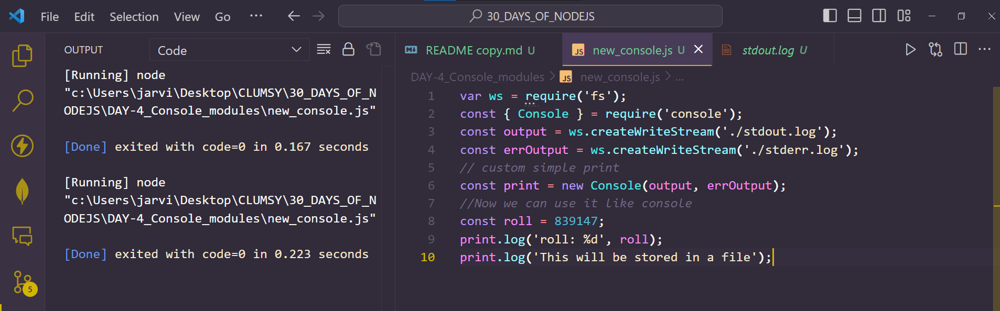
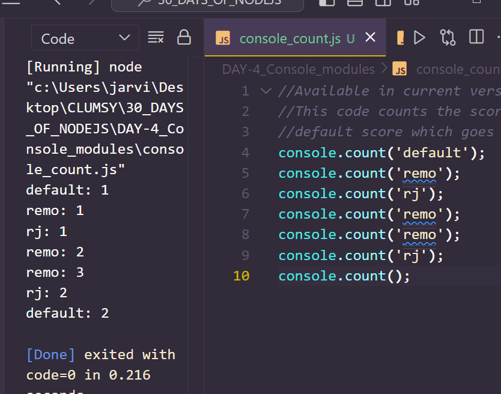
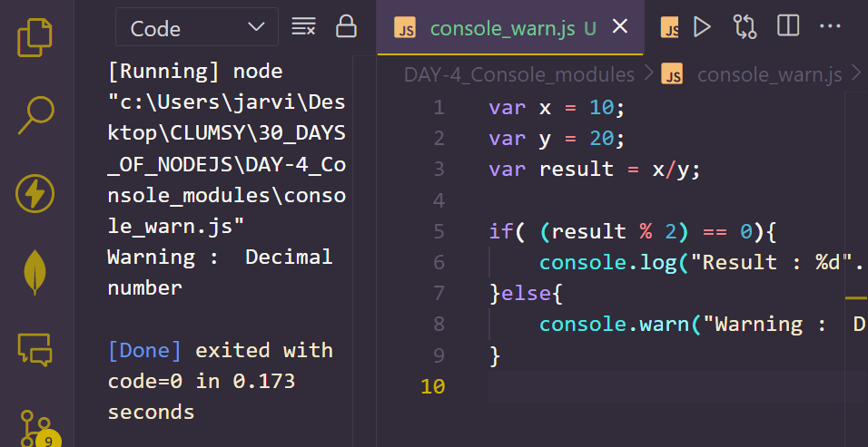

# Day 4
# CONSOLE MODULE IN NODE.JS

**The `console` module provides us with debugging console similar to javascript console mechanism web browsers provide us. It exports two components:**
1. console class : It includes methods such as `console.log()`,`console.warn()`,`console.error()` which we can use to write to node.js streams.
2. Global console instance: This method is configured to write on `process.stderr`, `process.stdout()` and it can be used without exclusively calling the module `require('console')`.

## Console.log() and all its variations 
**`console.log()` is used to print to `stdout` with a newline. We can pass multiple arguments. Let's see the different variations of `console.log` in the example given below:**

```
//using ' ' to print
console.log('1 : hello world !');
//using " " to print
console.log("2 : this will also work");

var str = 'BalaTheDeveloperOps';

var val = 25;
//printing a string
console.log(str);   //3
//printing a variable and replacing the 
//value of variable in place of %d
console.log('4: Value of val is : %d' , val);
//replacing a string in place of %s
console.log('5: %s' , 'this will be printed after 5');	
//concatenating in console		
console.log("6 : str = " + str);	
```
*Output*
```
>node "console.log().js"
1 : hello world !
2 : this will also work
BalaTheDeveloperOps
4: Value of val is : 25
5: this will be printed after 5
6 : str = BalaTheDeveloperOps
```
## CREATE A NEW CONSOLE
**Creating a new console where `stdout` will store the output and `stderr.log` will store the errors (if any).**
```
var ws = require('fs');
const { Console } = require('console');
const output = ws.createWriteStream('./stdout.log');
const errOutput = ws.createWriteStream('./stderr.log');
// custom simple print
const print = new Console(output, errOutput);
//Now we can use it like console
const roll = 839147;
print.log('roll: %d', roll);
print.log('This will be stored in a file');
```



## console.clear()
**This method is used to clear the console. Clearing the console can be useful while dealing with a big program in which you are logging a lot of stuff and while performing debugging , you want to see output after a certain point. For e.g. in the snippet below we are printing the value which changes in the program so we will clear the previous values from the console and see only the final value in the end. This is a very simple example of how `console.clear` method can be used.**

```
//Available in Current Version
var value = 10;
console.log("Value : %d", value);
console.clear();
value *= value;
console.log("Value : %d", value);	
```

## console.count()
**This module is used to maintains an internal label and output to stdout the number of times console.count() is called with any particular label. For e.g. in the snippet below labels are default , remo and rj whose occurrences are printed in the console. The default label is default .**

```
//Available in current version
//This code counts the score of remo , rj and 
//default score which goes to none of them 
console.count('default');
console.count('remo');
console.count('rj');
console.count('remo');
console.count('remo');
console.count('rj');
console.count();
```


## console.error()
**This method is used to print to `stderr`. We can pass multiple arguments where first argument is primary and remaining arguments are substitution values.**
```
var x = 10;
var y = 20;
var result = x/y;

if(result == 2){
    console.log("Result : %d".result)
}else{
    console.error("Error : Error in Positioning Operands");
}							
	
```

## console.time() and console.timeEnd()

**`console.time` method is used to start a timer which can be used to compute the duration of operation. Each timer is identified using unique**
```
console.time('division');
var x = 10;
var y = 20;
var result = x/y;

if(result == 2){
    console.log("Result : %d".result)
}else{
    console.log("Result : " + result);
}
console.timeEnd('division');	
```
*output*
```
node "console.time().js"
Result : 0.5
division: 2.895ms	
```

## console.warn()
**This method is similar to `console.error` and is used to print to `stderr`.**
```
var x = 10;
var y = 20;
var result = x/y;

if( (result % 2) == 0){
    console.log("Result : %d".result)
}else{
    console.warn("Warning :  Decimal number");
}							

```
*Output*

