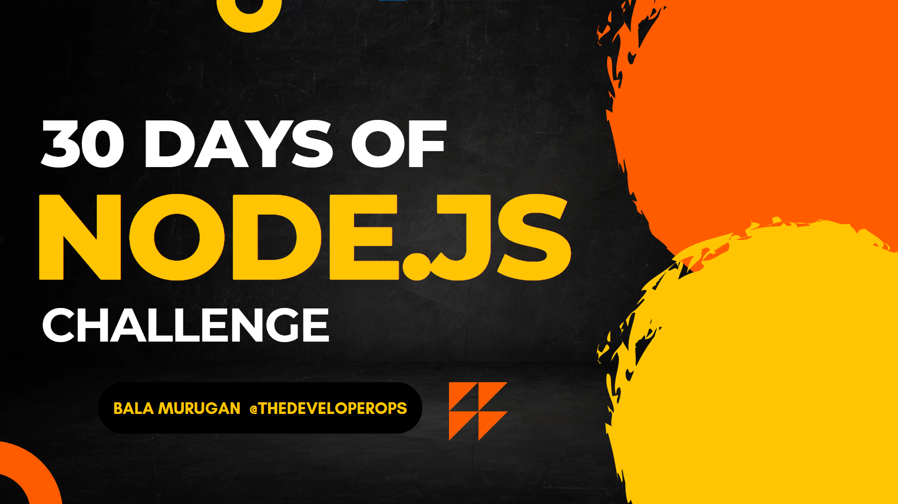

# DAY 1
## ALL ABOUT SERVERS
## AUG 01 2023

# DAY 2 
## FILE SYSTEM IN NODEJS
## AUG 02 2023 

# DAY 3
## REGULAR EXPRESSION
## AUG 03 2023

# DAY 4
## CONSOLE PACKAGES
## AUG 04 2023

# DAY 5
## ERROR
## AUG 05 2023

# DAY 6
## ARRAY METHODS
## AUG 06 2023

# DAY 7
## ABOUT NPM
## AUG 07 2023

# DAY 8
## PUBLISHING PACKAGES ON NPM
## AUG 08 2023

# DAY 9 
## ALL ABOUT CRYPTO MODULE IN NODE
## AUG 09 2023

# DAY 10 
## ENCRYPTION AND DECRYPTION IN NODEJS
## AUG 10 2023 

# DAY 11
## EXPRESS FRAMEWORK
## AUG 11 2023 

# DAY 12
## CRUD OPERATION IN MONGO 
## AUG 12 2023

# DAY 13
## SIGN UP FORM 
## AUG 13 2023

# DAY 14 
## SOCKET.IO
## AUG 14 2023 

# DAY 15
## STREAMS
## AUG 15 2023 
