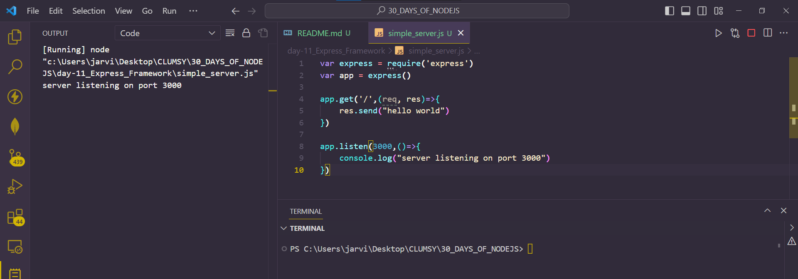
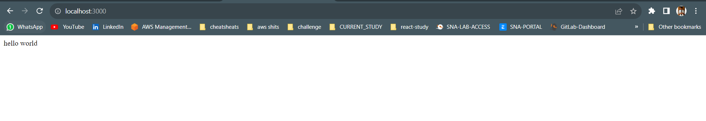
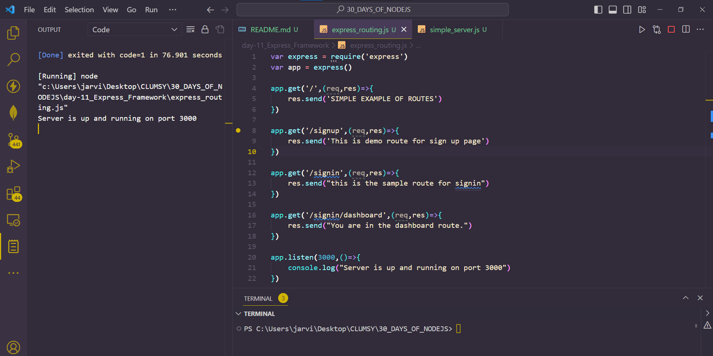
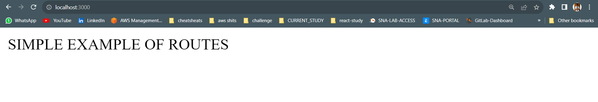
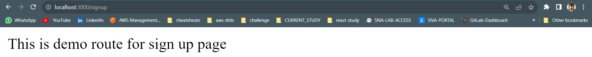
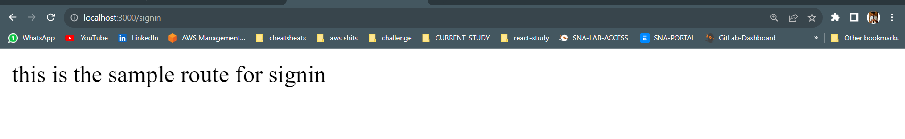
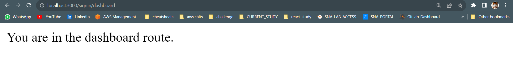

# Day 11
# EXPRESS FRAMEWORK

**Express.js or simply express is a minimal node.js web apps framework which is flexible and provides a set of features such as simple APIs used for building backend of websites and mobile applications. Express is open-source and currently maintained by node.js foundation. Express also provides us with very basic middleware and declarative routing.**

*Advantages of express framework:*
- It makes routing pretty easy
- As it is built on top of node.js, so fast I/O

## Installing express
**We can install express in the following ways:**
1. Installing express globally
`> npm install express -g`

2. Installing express locally:
`>npm install express`

3. Installing express with `--save` flag:
`>npm install express --save`

## Simple server in express.js
**Let's create a simple server in express which wil send `hello world` as the response to the user.**

```
var express = require('express')
var app = express()

app.get('/',(req, res)=>{
    res.send("hello world")
})

app.listen(3000,()=>{
    console.log("server listening on port 3000")
})
```

*OUTPUT*




## Routing in express.js
**One of the biggest advantage of using express is that is makes routing very simple. An example which explains routes in a very simple way is given below:**

```
var express = require('express')
var app = express()

app.get('/',(req,res)=>{
    res.send('SIMPLE EXAMPLE OF ROUTES')
})

app.get('/signup',(req,res)=>{
    res.send('This is demo route for sign up page')
})

app.get('/signin',(req,res)=>{
    res.send("this is the sample route for signin")
})

app.get('/signin/dashboard',(req,res)=>{
    res.send("You are in the dashboard route.")
})

app.listen(3000,()=>{
    console.log("Server is up and running on port 3000")
})
```

*We can open any of the following in our browser :*
- Now open `http://127.0.0.1:3000` in your browser for default route
- `http://127.0.0.1:3000/signup` for demo signup route.
- `http://127.0.0.1:3000/signin` for demo signin route.
- `http://127.0.0.1:3000/signin/dashboard` for demo dashboard route.
*Output*






## Request with parameters in express.js
**In order to understand how the request with parameters is handles in express let's take an example: Suppose we have a sign up module in which we are receiving 3 parameters from the front-end which are name, email and password. (Normally, we store data in a database. We will perform that in the coming chapter. For now , just focus on understanding just the request with parameters part)**

```
var express = require('express');
var fs = require('fs')

var app = express()

app.get('/', function (req, res) {
  res.send('Simple Example of routes!');
}) 

app.get('/signup', function(req,res){
	// this is how we will receive params from front end 
	
	var name = req.query.name; 
  var email = req.query.email;
  var password = req.query.password;
  //For demo purpose
  console.log(name + '' + email + ' ' + password);

  /**
   * Store this in a database and perform further processing
   */
    res.send("In signup module")
});

app.listen(3000, function () {
  console.log('Server is listening at 3000')
})
```

*OUTPUT*
```
>node routes-with-params.js
Server is listening at 3000
```