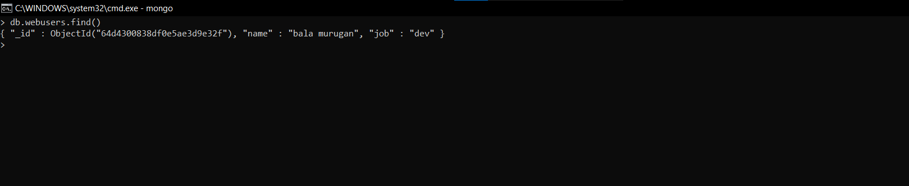

# Day 12
# CRUD OPERATION IN MONGODB

## What is mongodb? 

**Classified ass a No SQL database, MongoDB is a scalable,open source, high performance, document-oriented database designed by keeping developers agility in mind. It is document-oriented which means that it does not store data in tables and rows as we would in relational databases like MySQL, In this we store data in JSON-like document which dynamic schema.**

*Advantages*
- `Dynamic schema` : if we have a flexible schema it is ideal for JSON-like documents as in MongoDB however it is difficult to implement it in a good manner in Relational databases.
- `Scalability` : MongoDB is highly scalable.
- `Cheap` : Can be downloaded at free of cost.

## ESTABLISHING CONNECTION WITH DB
**The first is to establish a connection between the `mongodb  ` database and our `node.js` application.**

```
var mongo = require('mongo')
var new_db = "mongodb://localhost:27017/demo_db"

```
*Here*
- demo_db is the name of the db to be created.
- 27017 is the port number where mongodb is running. 
- localhost signifies that currently the db is running locally.

**Now, We will establish  the connection using `connect` method. Connect() is an inbuilt method used to create a connection to a MongoDB instance and returns the reference to the database. It instantiates a new connection to the MOngoDB instance running on the localhost interface and returns a reference to demo_db. Snippet for establishing connection using connect method is given below:**


```
const { MongoClient } = require('mongodb')

// Create Instance of MongoClient for mongodb
const client = new MongoClient('mongodb://localhost:27017')

// Connect to database
client.connect()
    .then(() => console.log('Connected Successfully'))
    .catch(error => console.log('Failed to connect', error))


```
*OUTPUT*


```
const express = require('express');
const mongoose = require('mongoose');

const app = express();

mongoose
  .connect('mongodb://localhost:27017/demo_db', {
    useNewUrlParser: true,
    useUnifiedTopology: true
  })
  .then(() => {
    console.log('Successfully connected to MongoDB');
    app.listen(3000, () => {
      console.log('Listening on port 3000');
    });
  })
  .catch((err) => {
    console.error('Error connecting to MongoDB:', err);
  });
```


## Insert/Create Operation in MongoDb
1. `insertOne()` :  insertOne() is an inbuilt method which is used to insert data in the mongoDb collection. Snippet for the following is given below :

```
const MongoClient = require('mongodb').MongoClient;
const url = 'mongodb://localhost:27017';

MongoClient.connect(url)
  .then((client) => {
    const db = client.db('mydbfirst');
    const mydata = { name: 'bala murugan', site: 'flowcv.me/bala-murugan' };

    return db.collection('webusers').insertOne(mydata);
  })
  .then(() => {
    console.log('Document inserted');
  })
  .catch((err) => {
    console.error('Error:', err);
  });

```

*OUTPUT*


## Read Operation in MongoDb

1. `findOne()`:  findOne() is an inbuilt method which is used to Read the first occurrence of the data from the mongoDb collection.

```
const MongoClient = require('mongodb').MongoClient

const url = 'mongodb://localhost:27017'

MongoClient.connect(url)
    .then((client)=>{
        const db=client.db('mydbfirst')
        return db.collection('webusers').findOne({name:'bala murugan'})
    })
    .then((result)=>{
        if(result){
            console.log('Found users:',result)
        }
        else{
            console.log('user not found')
        }
    })
    .catch((err)=>{
        console.log('err',err)
    })
```

*OUTPUT*


## Update data in an document

1. `updateOne()`: updateOne() is an inbuilt method of mongodb which is used to search the first occurance of the data and update it.

```
const MongoClient = require('mongodb').MongoClient;
const url = 'mongodb://localhost:27017';

MongoClient.connect(url)
  .then((client) => {
    const db = client.db('mydbfirst');

    const query = { name: 'bala murugan' };
    const update = { site: '10th standard' };

    return db.collection('webusers').updateOne(query, { $set: update });
  })
  .then((result) => {
    if (result.modifiedCount > 0) {
      console.log('Document updated successfully');
    } else {
      console.log('No documents matched the query');
    }
  })
  .catch((err) => {
    console.error('Error:', err);
  });

```
*OUTPUT*


2. updateMany() is the inbuilt method of mongodb which is used to search for the given query and update all its occurances.

```
const MongoClient = require('mongodb').MongoClient;
const url = 'mongodb://localhost:27017';

MongoClient.connect(url)
  .then((client) => {
    const db = client.db('mydbfirst');

    const query = {}; // Empty query to match all documents
    const update = { $set: { weather: 'sunny', day: 'sunday' } };

    return db.collection('webusers').updateMany(query, update);
  })
  .then((result) => {
    if (result.modifiedCount > 0) {
      console.log('Documents updated successfully');
    } else {
      console.log('No documents matched the query');
    }
  })
  .catch((err) => {
    console.error('Error:', err);
  });

```

*OUTPUT*


## Delete a document

1. deleteOne(): deleteOne() is the inbuilt method of mongodb which is used to delete the first occurance of the data provided in the search query.

```
const MongoClient = require('mongodb').MongoClient;
const url = 'mongodb://localhost:27017';

MongoClient.connect(url)
  .then((client) => {
    const db = client.db('mydbfirst');

    const query = { name: 'bala murugan' };

    return db.collection('webusers').deleteOne(query);
  })
  .then((result) => {
    if (result.deletedCount > 0) {
      console.log('Document deleted successfully');
    } else {
      console.log('No documents matched the query');
    }
  })
  .catch((err) => {
    console.error('Error:', err);
  });
```
*OUTPUT*


2. `deleteMany()`:deleteMany() is the inbuilt method of mongodb which is used to delete all the occurances of the data provided in the search query.

```
const MongoClient = require('mongodb').MongoClient;
const url = 'mongodb://localhost:27017';

MongoClient.connect(url)
  .then((client) => {
    const db = client.db('mydbfirst');

    const query = { weather: 'sunny' };

    return db.collection('webusers').deleteMany(query);
  })
  .then((result) => {
    if (result.deletedCount > 0) {
      console.log('Documents deleted successfully');
    } else {
      console.log('No documents matched the query');
    }
  })
  .catch((err) => {
    console.error('Error:', err);
  });

```
*OUTPUT*




