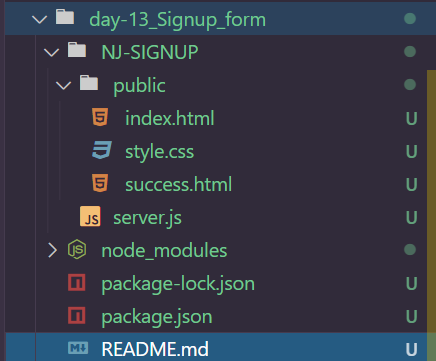
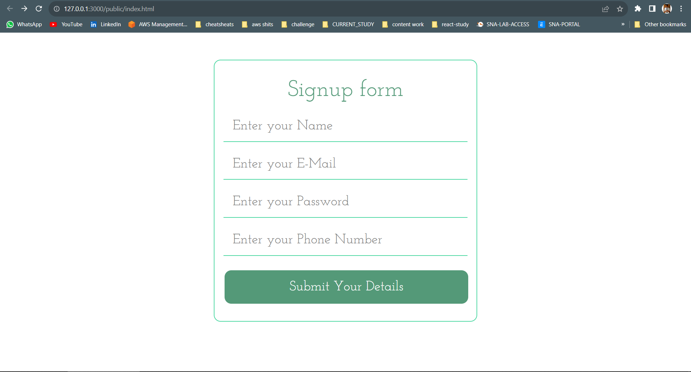
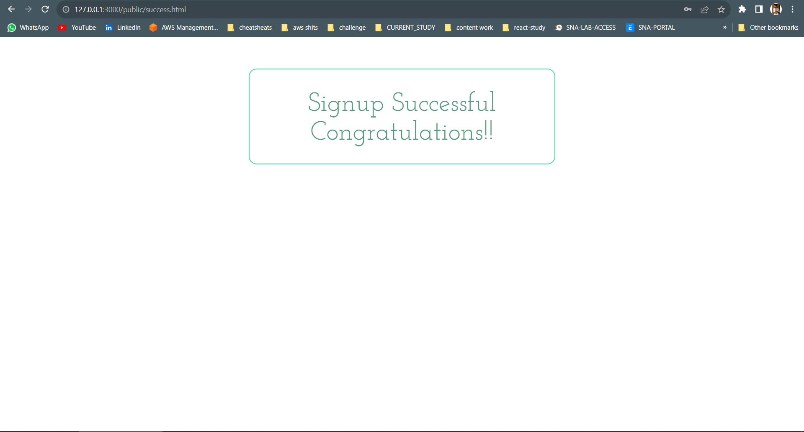
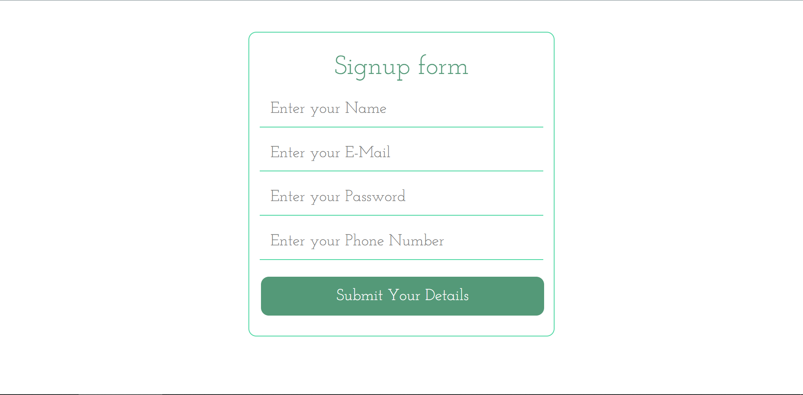
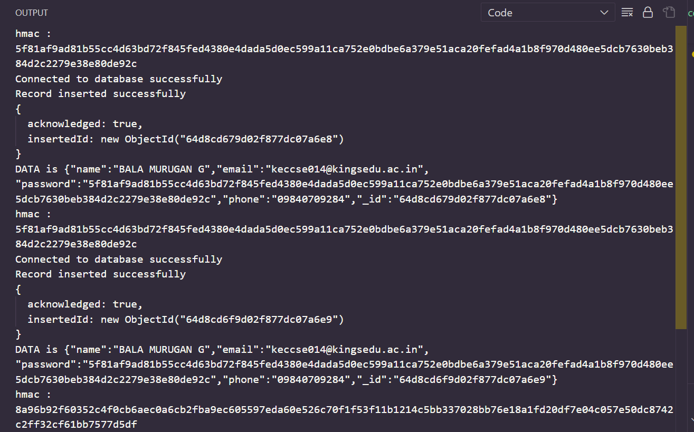
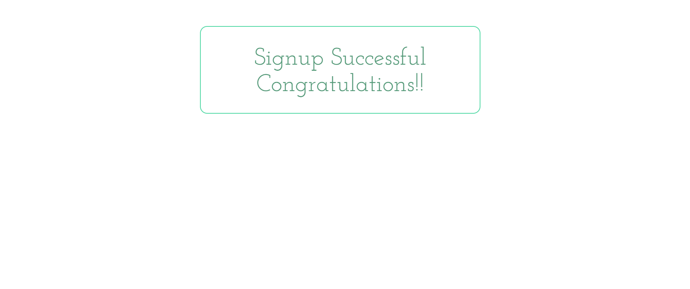

# Day 13
# SIGN UP FORM IN NODE.JS

**We've reached day 13th of our 30 days of node and here we are with our first project tutorial in which we create a login system using HTML5 , CSS3 , bootstrap , node , express and mongodb. What's unique about this tutorial is that you get to learn everything from the html and styles to complex technical topics like perform HMAC operation on password.**
*Please Note that encrypting passwords with SHA is unsafe and we strongly recommend that you should not use it in production.*\


## DIRECTORY STRUCTURE 



## Frontend using static html
**Let's start by creating a simple static form in HTML5**

1. Name : It takes user name as input. Validations are not implemented here.
2. Email : It takes email id as input. Validations are implemented using HTML5 so, only valid emailID will work.
3. Password : It takes password as the input. Validations are not implemented.
4. Phone : It takes the contact number of user as input. Validations are not implemented.
5. Submit : When we click the submit button, the action attribute of form tag will direct the data to the sign_up route of the backend app .

*INDEX.html*

```
<html>
	<head>
		<title> Signup Form | nodejsera </title>
		
		<!-- Including bootstrap v3.3.7 -->
		<link rel="stylesheet" href="https://maxcdn.bootstrapcdn.com/bootstrap/3.3.7/css/bootstrap.min.css" integrity="sha384-BVYiiSIFeK1dGmJRAkycuHAHRg32OmUcww7on3RYdg4Va+PmSTsz/K68vbdEjh4u" crossorigin="anonymous">
		
		<!-- Including Custom css -->
		<link rel="stylesheet" type="text/css" href="style.css">
		
	</head>
	<body>
	
		<br>
		<br>
		<br>
		<div class="container" >
			<div class="row">
				<div class="col-md-3">
					<!-- Blank DIV -->
				</div>
				
				<div class="col-md-6 main">
					<!-- Form Tag starts here -->
					<!-- Action attribute is the route on backend. Method is POST -->
					<form action="/sign_up" method="post">
					
						<h1> Signup form </h1>
							
						<input class="box" type="text" name="name" id="name" placeholder="Enter your Name"  required /><br>
							
						<input class="box" type="email" name="email" id="email" placeholder="Enter your E-Mail " required /><br>
							
						<input class="box" type="password" name="password" id="password"  placeholder="Enter your Password " required/><br>
							
						<input class="box" type="text" name="phone" id="phone"  placeholder="Enter your Phone Number " required/><br>
						<br>
						<input type="submit" id="submitDetails"  name="submitDetails" value="Submit Your Details" /><br>
					
					</form>
					
				</div>
				
				
				<div class="col-md-3">
					<!-- Blank DIV -->
				</div>
				
			</div>
		</div>
	</body>
</html>
```
*output*



**`success.html`: When user entry has been successfully created, then user will be redirected by the server to the success.html page, otherwise the error message will be printed.**

```
<html>
	<head>
		<title> Signup Form | nodejsera </title>
		<link rel="stylesheet" href="https://maxcdn.bootstrapcdn.com/bootstrap/3.3.7/css/bootstrap.min.css" integrity="sha384-BVYiiSIFeK1dGmJRAkycuHAHRg32OmUcww7on3RYdg4Va+PmSTsz/K68vbdEjh4u" crossorigin="anonymous">
		
		<link rel="stylesheet" type="text/css" href="style.css">
	</head>
	<body>
		<br>
				<br>
				<br>
		<div class="container" >
			<div class="row">
				<div class="col-md-3">
				</div>
				
				<div class="col-md-6 main">
					
					<h1> Signup Successful <br> Congratulations!!</h1>
					
				</div>
				
				
				<div class="col-md-3">
				</div>
				
			</div>
		</div>
	</body>
</html>

```
*OUTPUT*


*style.css*
```
@import url('https://fonts.googleapis.com/css?family=Josefin+Slab');

.main{
	padding:20px;
	font-family: 'Josefin Slab', serif;
	border : 2px solid #50d8a4;
	border-radius: 15px;
	
}
.main h1{
	font-size: 50px;
	text-align:center;
	font-family: 'Josefin Slab', serif;
	color: #549978;
}
input{
	font-family: 'Josefin Slab', serif;
    width: 100%;
	font-size: 30px;
    padding: 12px 20px;
    margin: 8px 0;
    border: none;
    border-bottom: 2px solid #50d8a4;
}
input[type=submit] {
	font-family: 'Josefin Slab', serif;
	width: 100%;
    background-color: #549978;
    border: none;
    color: white;
    padding: 16px 32px;
    text-decoration: none;
    margin: 4px 2px;
    cursor: pointer;
	border-radius: 15px;
}
input:focus,
select:focus,
textarea:focus,
button:focus {
    outline: none;
}

input:hover {
	font-family: 'Josefin Slab', serif;
    width: 100%;
    padding: 12px 20px;
    margin: 8px 0;
    box-sizing: border-box;
	border: none;
    border-bottom: 2px solid #549978;
}

input[type=submit]:hover {
	font-family: 'Josefin Slab', serif;
	width: 100%;
    background-color: #549978;
    border: none;
    color: white;
    padding: 16px 32px;
    text-decoration: none;
    margin: 4px 2px;
    cursor: pointer;
	border-radius: 15px;
}
```


*SERVER.js*

```
var express = require('express');
var path = require('path');
var { MongoClient } = require('mongodb');
var bodyParser = require('body-parser');
var crypto = require('crypto');

var app = express();
var new_db = "mongodb://localhost:27017/database_name";

app.get('/', function(req, res) {
    res.set({
        'Access-Control-Allow-Origin': '*'
    });
    return res.redirect('/public/index.html');
}).listen(3000);

console.log("Server listening at : 3000");
app.use('/public', express.static(__dirname + '/public'));
app.use(bodyParser.json());
app.use(bodyParser.urlencoded({
    extended: true
}));

var getHash = (pass, phone) => {
    var hmac = crypto.createHmac('sha512', phone);
    data = hmac.update(pass);
    gen_hmac = data.digest('hex');
    console.log("hmac : " + gen_hmac);
    return gen_hmac;
}

app.post('/sign_up', async function(req, res) {
    var name = req.body.name;
    var email = req.body.email;
    var pass = req.body.password;
    var phone = req.body.phone;
    var password = getHash(pass, phone);

    var data = {
        "name": name,
        "email": email,
        "password": password,
        "phone": phone
    }

    try {
        const client = new MongoClient(new_db, { useUnifiedTopology: true });
        await client.connect();
        console.log("Connected to database successfully");
        const db = client.db();
        const result = await db.collection("details").insertOne(data);
        console.log("Record inserted successfully");
        console.log(result);
        client.close();
    } catch (error) {
        console.error("Error connecting to database:", error);
        res.status(500).send("Error connecting to database");
        return;
    }

    console.log("DATA is " + JSON.stringify(data));
    res.set({
        'Access-Control-Allow-Origin': '*'
    });
    return res.redirect('/public/success.html');
});

```

## screenshots 





