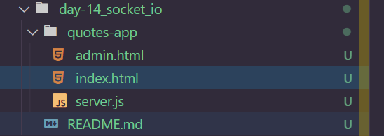
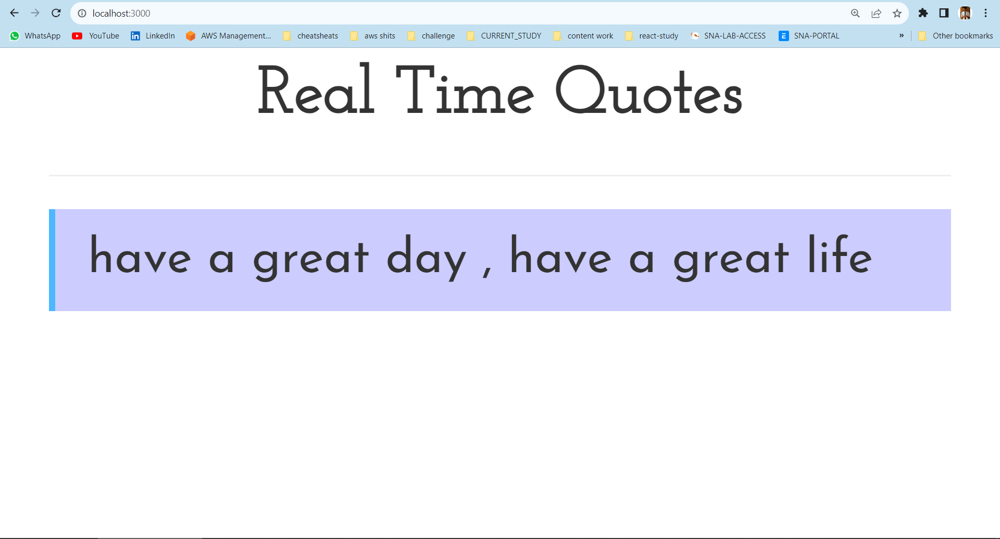
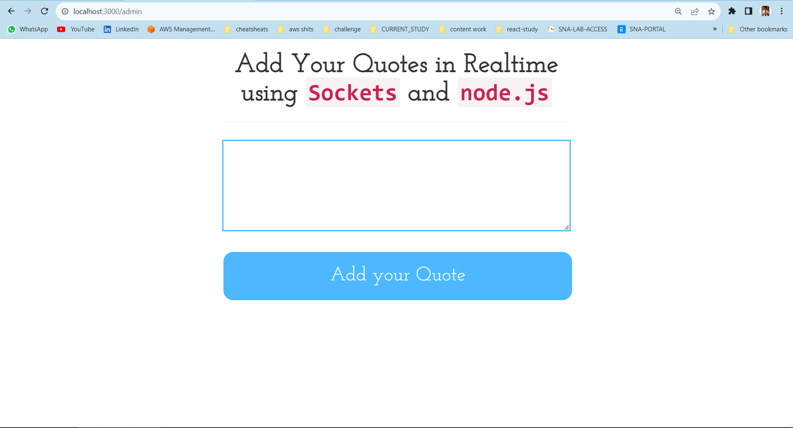
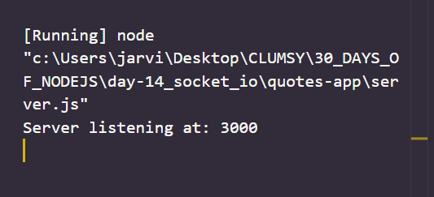

# Day 14
# Introduction to SOCKET.IO

**Web Sockets allow us to set up bi-directional persistent communication channels between two or more machines at a time.**

## Features of SOCKET.io

1. `Real-time analytics` : It is used to push data to clients which can further be represented as charts, logs, etc in real-time.

2. `Document collaboration` : It allows users to make changes to a document concurrently and the changes are also visible to all the connected nodes/users in real-time.

3. `Binary streaming` : It is possible to send and receive any BLOB. i.e. image,audio, video , etc in real-time.

4. `Instant messaging and chat` : It allows users to perform real-time chatting application in just a few lines of code.

## App 1: Simple `Real-Time Quotes` app using socket.io

### Overview
**This application is developed using node.js , socket.io , express.js , HTML5 , CSS3 , and little bit of jquery . In our real-time quotes app , We update the quotes in real-time on all the tabs where index.html page is open. The updation of quotes is done from the admin.html file which is further using sockets under the hood.It is explained in detail along with its code below.**

*index.html*
```
<html> 
<head>
	<title> Real Time Quotes | Nodejsera </title>
	
	<!-- Including google font Josefin Sans -->
	<link href="https://fonts.googleapis.com/css?family=Josefin+Sans|Josefin+Slab" rel="stylesheet">
	<!-- Including bootstrap v3.3.7 -->
	<link rel="stylesheet" href="https://maxcdn.bootstrapcdn.com/bootstrap/3.3.7/css/bootstrap.min.css">
	<!-- Including jquery v3.2.1 -->
	<script src="https://ajax.googleapis.com/ajax/libs/jquery/3.2.1/jquery.min.js"></script>
	<!-- Including socket.io file v2.0.3 -->
	<script src="https://cdnjs.cloudflare.com/ajax/libs/socket.io/2.0.3/socket.io.js"></script>
	
	<!-- Custom CSS to make it presentable -->
	<style>	
		.font{
			font-family: 'Josefin Slab', serif;
			text-align:center;
			font-size: 40px;
			font-weight:bold;
		}
		blockquote{
			font-family: 'Josefin Sans', sans-serif;
			background:#ccccff;
			font-size: 30px;
			font-weight: normal;
			border-left: 4px solid #4db8ff;
		}	
	</style>
	
  
</head>
<body> 

		<div class="container"> 
			<div class="col-md-2">
			
			</div>
			<div class="col-md-8">	
				<!-- Heading -->
				<div class="font"> Real Time Quotes  </div> 
				<hr>
				<!-- Default quote -->
				<div class="quotes" id="quotes"> 
					<blockquote> have a great day , have a great life </blockquote>  
				</div> 
			</div>
			<div class="col-md-2">
			</div>

		</div> 

	<script>
		//Jquery code starts here
		$('document').ready(function(){
			//Connecting the socket to host and port
		  var socket = io.connect('http://localhost:3000');
			//Test event 
			//Users can skip it.
		  socket.on('news', function (data) {
			console.log(data);
			socket.emit('my other event', { my: 'data' });
		  });
		  //Test event ends here
		  //Main event "next" 
		  socket.on('next' , function(data) {
			  console.log(data); 
			  $('#quotes').append("<blockquote>" + data.data.quote + "</blockquote>")
		  })
		  //Event ends

		});
		//jquery code ends here
	</script>

</body> 
</html> 
```

*admin.html*
```
<html> 
<head> 
	<title> Real Time Quotes | Admin Panel | Nodejsera </title>
	
	<!-- Including google font Josefin Sans -->
	<link href="https://fonts.googleapis.com/css?family=Josefin+Sans|Josefin+Slab" rel="stylesheet">
	<!-- Including bootstrap v3.3.7 -->
	<link rel="stylesheet" href="https://maxcdn.bootstrapcdn.com/bootstrap/3.3.7/css/bootstrap.min.css">
	<!-- Including jquery v3.2.1 -->
	<script src="https://ajax.googleapis.com/ajax/libs/jquery/3.2.1/jquery.min.js"></script>
	<!-- Including socket.io file v2.0.3 -->
	<script src="https://cdnjs.cloudflare.com/ajax/libs/socket.io/2.0.3/socket.io.js"></script>
 
	<!-- Custom CSS to make it look presentable -->
    <style>	
		.font{
			font-family: 'Josefin Slab', serif;
			text-align:center;
			font-size: 40px;
			font-weight:bold;
		}
		textarea {
			font-family: 'Josefin Slab', serif;
			width: 100%;
			min-height: 100px;
			font-size: 40px;
			padding: 12px 20px;
			margin: 8px 0;
			border: 2px solid #4db8ff;
		   
		}

		input[type=button]{
			font-family: 'Josefin Slab', serif;
			width: 100%;
			background-color: #4db8ff;
			border: none;
			color: white;
			font-size: 30px;
			padding: 16px 32px;
			text-decoration: none;
			margin: 4px 2px;
			cursor: pointer;
			border-radius: 15px;
		}
		input:hover{
			 background-color: #008ae6;
		}
		input:focus,
		textarea:focus,
		button:focus {
			outline: none;
		}

	</style> 
</head> 
<body> 


	<div class="container"> 
		<div class="col-md-3">
		</div>
		<div class="col-md-6">
			<!-- Heading -->
			<h1 class="font">
				Add Your Quotes in Realtime using <code> Sockets</code> and <code> node.js </code>
			</h1> 
			<hr> 
			
			<div>
				<!-- Text area where admin will write quote -->
				<textarea id="qcontent"></textarea>
				<br> 
				<br>
				<!-- Quotes Tranferred to server when button is clicked via "new" event-->
				<div>
					<input type="button" id="aquote" value="Add your Quote">  </button>
				</div>
			</div>
		</div>
		<div class="col-md-3">
		</div>
	</div> 

	<script>
	//Jquery code starts
	$('document').ready(function(){
	//Connecting the socket to host and port
	 var socket = io.connect('http://localhost:3000');
	   socket.on('welcome', function (data) {
		
	  });
		
	  $('#aquote').click(function(){
		  data = $('#qcontent').val()
		  console.log(data); 
		  //Emitting the event and passing the quote to the server
		  socket.emit('new' , { quote: data })
		  $('#qcontent').val('');
	  })


	})
	//jquery code ends
	</script>

</body> 
</html> 
```

*server.js*
```
											
//Including the required files
var app = require('express')();
var server = require('http').Server(app);
var io = require('socket.io')(server);
//server listening at 127.0.0.1:3000
server.listen(3000);
console.log("Server listening at: 3000");
//Handling the default route
app.get('/', function (req, res) {
  res.sendFile(__dirname + '/index.html');
});
//Handling the route for admin
app.get('/admin' , function(req,res) {
    res.sendFile(__dirname + '/admin.html'); 
})
//Code for sockets
io.on('connection', function (socket) {
  
  socket.emit('welcome', { data: 'welcome' });

  socket.on('new' , function(data) {   
          console.log('About to upload Quote')
          io.sockets.emit( 'next' , { data : data } )
    })
});

```

## screenshots 

*Directory Structure*


*index.html*
 

*admin.html*


*console output*
