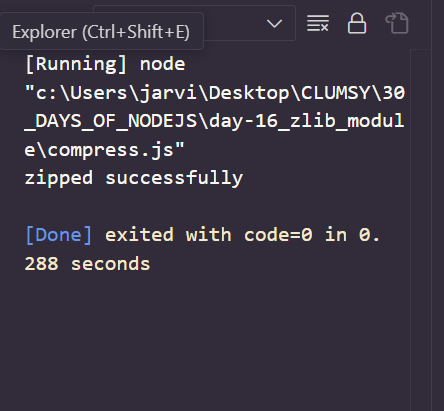
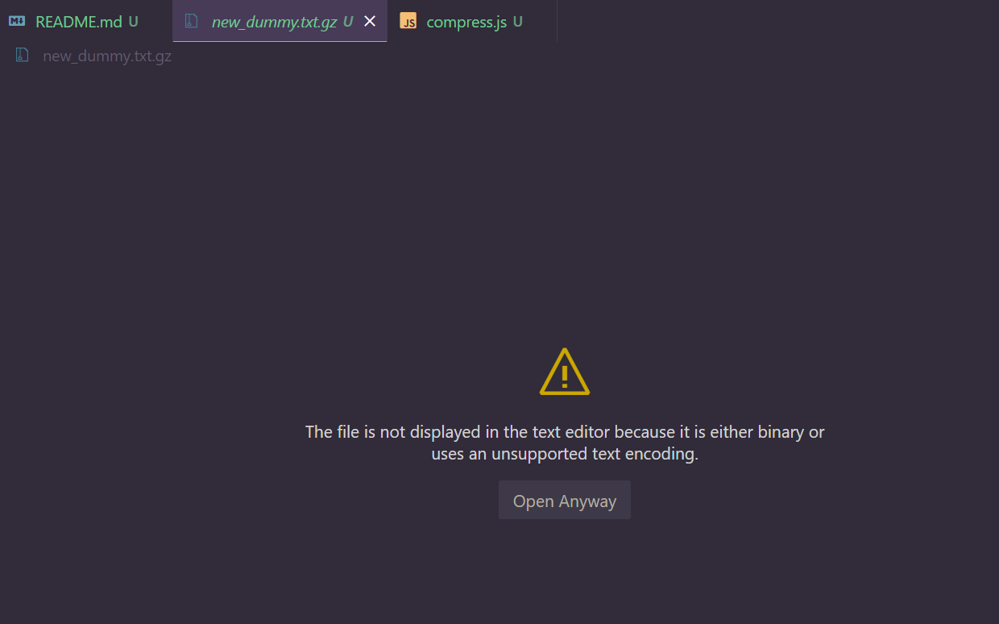
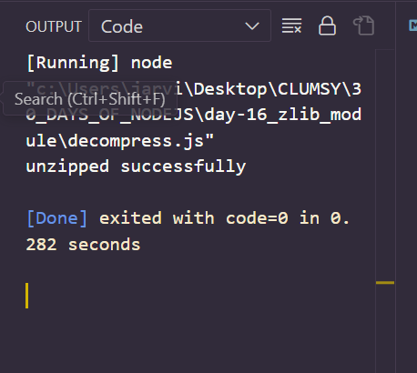
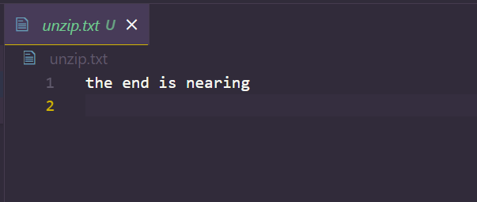

# Day 16
# zlib module 

- zlib module is used to provide compression and decompression functionalities in node.js .
- In simple words , it is used to zip or unzip files.
- These functionalities are implemented using GZIP and deflate/inflate .
- We can use the zlib module via requiring it in the following way :

`var zlib = require('zlib')`

## Compress a file using node.js zlib module

*code snippet*

```
var zlib = require('zlib')
var fs = require('fs')

var zip = zlib.createGzip();

var read = fs.createReadStream('dummy.txt')
var write = fs.createWriteStream('new_dummy.txt.gz')

read.pipe(zip).pipe(write)
console.log("zipped successfully")
```

*output*


*new dummy.txt.jz file created successfully*


## Decompress a file using node.js zlib module 

*code snippet*

```
var zlib = require('zlib')
var fs = require('fs')
var unzip =zlib.createUnzip();

var read = fs.createReadStream('dummy.txt.gz')
var write = fs.createWriteStream('unzip.txt')

read.pipe(unzip).pipe(write)
console.log("unzipped successfully")
```

*OUTPUT*





## Methods of zlib module 

- createDeflate()
- createInflate()
- createDeflateRaw()
- createInflateRaw()
- deflateSync()
- inflateSync()
- deflateRaw()
- inflateRaw()
- deflateRawSync()
- inflateRawSync()
- gzip()
- unzip()
- gzipSync()
- unzipSync()
- createGzip()
- createGunzip()