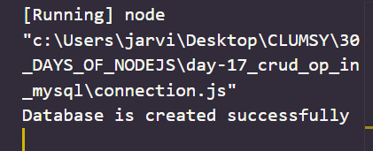
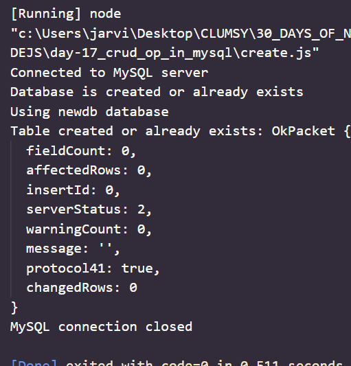
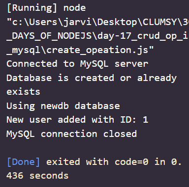
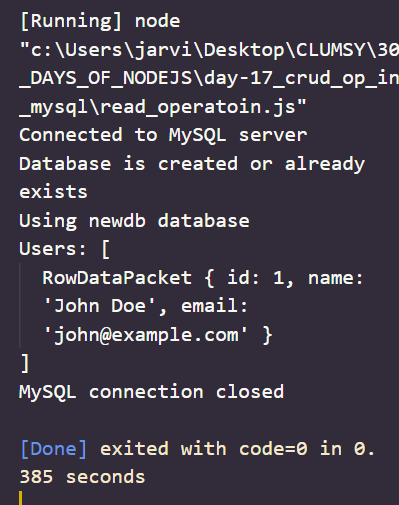
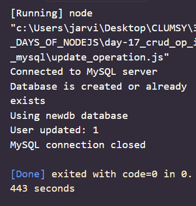
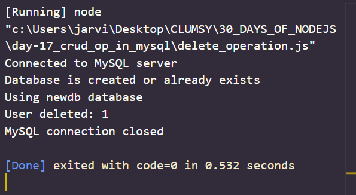
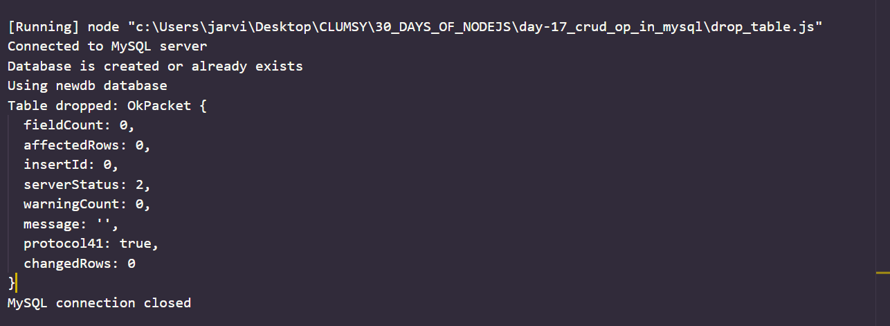

# Day 17
# CRUD OPERATION IN MYSQL

**MySQL is world's leading relational database management system based on SQL (Structured Query Language). It  is written in C and C++ and is manged by MySQL AB which  is a sweden based company. MySQL stores data in the form of rows and columns within a table.**

## Features 

- Cross platform support
- Query caching 
- SSL support 
- Triggers 
- cursors etc..

## ESTABLISHING A CONNECTION 
**The first step is to establish a connection between the `mysql` database and our `node.js` application.**

```
var mysql = require('mysql'); 
var conn = mysql.createConnection({ 
  host: "localhost",
  user: "root", 
  password: "" 
}); 
conn.connect(function(err) { 
  if (err) throw err; 
  conn.query("CREATE DATABASE nodeapp",
  function (err, result) { 
    if (err) throw err; 
    console.log("Database is created successfully");
     }); 
});
```

*output*



## Creating a Table in MySQL using node.js

*code*
```
var mysql = require('mysql'); 
var conn = mysql.createConnection({ 
  host: "localhost",
  user: "root", 
  password: "" 
}); 

conn.connect(function(err) { 
  if (err) throw err; 
  console.log("Connected to MySQL server");

  // Create the database
  conn.query("CREATE DATABASE IF NOT EXISTS newdb", function (err, result) { 
    if (err) throw err; 
    console.log("Database is created or already exists");

    // Use the new database
    conn.query("USE newdb", function (err) {
      if (err) throw err;
      console.log("Using newdb database");

      // Create the table
      const createTableQuery = `
        CREATE TABLE IF NOT EXISTS users (
          id INT AUTO_INCREMENT PRIMARY KEY,
          name VARCHAR(255) NOT NULL,
          email VARCHAR(255) NOT NULL
        )
      `;

      // Execute the create table query
      conn.query(createTableQuery, (err, results) => {
        if (err) throw err;
        console.log('Table created or already exists:', results);
      });

      // Close the connection when done
      conn.end((err) => {
        if (err) {
          console.error('Error closing MySQL connection:', err);
          return;
        }
        console.log('MySQL connection closed');
      });
    });
  });
});

```
*Output*




## Create operation in MySQL using node.js

```
var mysql = require('mysql'); 
var conn = mysql.createConnection({ 
  host: "localhost",
  user: "root", 
  password: "" 
}); 

conn.connect(function(err) { 
  if (err) throw err; 
  console.log("Connected to MySQL server");

  // Create the database
  conn.query("CREATE DATABASE IF NOT EXISTS newdb", function (err, result) { 
    if (err) throw err; 
    console.log("Database is created or already exists");

    // Use the new database
    conn.query("USE newdb", function (err) {
      if (err) throw err;
      console.log("Using newdb database");
        // create operation
      const newUser = { name: 'John Doe', email: 'john@example.com' };
      conn.query('INSERT INTO users SET ?', newUser, (err, results) => {
        if (err) throw err;
        console.log('New user added with ID:', results.insertId);
      });

      // Close the connection when done
      conn.end((err) => {
        if (err) {
          console.error('Error closing MySQL connection:', err);
          return;
        }
        console.log('MySQL connection closed');
      });
    });
  });
});

```
*OUTPUT*



## Read Operation in MySQL using node.js

*code*

```
var mysql = require('mysql'); 
var conn = mysql.createConnection({ 
  host: "localhost",
  user: "root", 
  password: "" 
}); 

conn.connect(function(err) { 
  if (err) throw err; 
  console.log("Connected to MySQL server");

  // Create the database
  conn.query("CREATE DATABASE IF NOT EXISTS newdb", function (err, result) { 
    if (err) throw err; 
    console.log("Database is created or already exists");

    // Use the new database
    conn.query("USE newdb", function (err) {
      if (err) throw err;
      console.log("Using newdb database");

    // Read operation
    conn.query('SELECT * FROM users', (err, rows) => {
        if (err) throw err;
        console.log('Users:', rows);
    });

      // Close the connection when done
      conn.end((err) => {
        if (err) {
          console.error('Error closing MySQL connection:', err);
          return;
        }
        console.log('MySQL connection closed');
      });
    });
  });
});

```

*Output*


## Update operation in MySQL

```
var mysql = require('mysql'); 
var conn = mysql.createConnection({ 
  host: "localhost",
  user: "root", 
  password: "" 
}); 

conn.connect(function(err) { 
  if (err) throw err; 
  console.log("Connected to MySQL server");

  // Create the database
  conn.query("CREATE DATABASE IF NOT EXISTS newdb", function (err, result) { 
    if (err) throw err; 
    console.log("Database is created or already exists");

    // Use the new database
    conn.query("USE newdb", function (err) {
      if (err) throw err;
      console.log("Using newdb database");

        // Update operation
        const userIdToUpdate = 1;
        const updatedUserData = { name: 'Updated Name', email: 'updated@example.com' };
        conn.query('UPDATE users SET ? WHERE id = ?', [updatedUserData, userIdToUpdate], (err, results) => {
        if (err) throw err;
        console.log('User updated:', results.affectedRows);
        });

      // Close the connection when done
      conn.end((err) => {
        if (err) {
          console.error('Error closing MySQL connection:', err);
          return;
        }
        console.log('MySQL connection closed');
      });
    });
  });
});

```

*OUTPUT*



## DELETE OPERATION 

```
var mysql = require('mysql'); 
var conn = mysql.createConnection({ 
  host: "localhost",
  user: "root", 
  password: "" 
}); 

conn.connect(function(err) { 
  if (err) throw err; 
  console.log("Connected to MySQL server");

  // Create the database
  conn.query("CREATE DATABASE IF NOT EXISTS newdb", function (err, result) { 
    if (err) throw err; 
    console.log("Database is created or already exists");

    // Use the new database
    conn.query("USE newdb", function (err) {
      if (err) throw err;
      console.log("Using newdb database");

        // Delete operation
        const userIdToDelete = 1;
        conn.query('DELETE FROM users WHERE id = ?', userIdToDelete, (err, results) => {
        if (err) throw err;
        console.log('User deleted:', results.affectedRows);
        });

      // Close the connection when done
      conn.end((err) => {
        if (err) {
          console.error('Error closing MySQL connection:', err);
          return;
        }
        console.log('MySQL connection closed');
      });
    });
  });
});
```
*OUTPUT*


## DROP a table in MySQL using nodejs

```
var mysql = require('mysql'); 
var conn = mysql.createConnection({ 
  host: "localhost",
  user: "root", 
  password: "" 
}); 

conn.connect(function(err) { 
  if (err) throw err; 
  console.log("Connected to MySQL server");

  // Create the database
  conn.query("CREATE DATABASE IF NOT EXISTS newdb", function (err, result) { 
    if (err) throw err; 
    console.log("Database is created or already exists");

    // Use the new database
    conn.query("USE newdb", function (err) {
      if (err) throw err;
      console.log("Using newdb database");

        // SQL query to drop the table
        const dropTableQuery = 'DROP TABLE IF EXISTS users';

        // Execute the drop table query
        conn.query(dropTableQuery, (err, results) => {
        if (err) throw err;
        console.log('Table dropped:', results);
        });

      // Close the connection when done
      conn.end((err) => {
        if (err) {
          console.error('Error closing MySQL connection:', err);
          return;
        }
        console.log('MySQL connection closed');
      });
    });
  });
});


