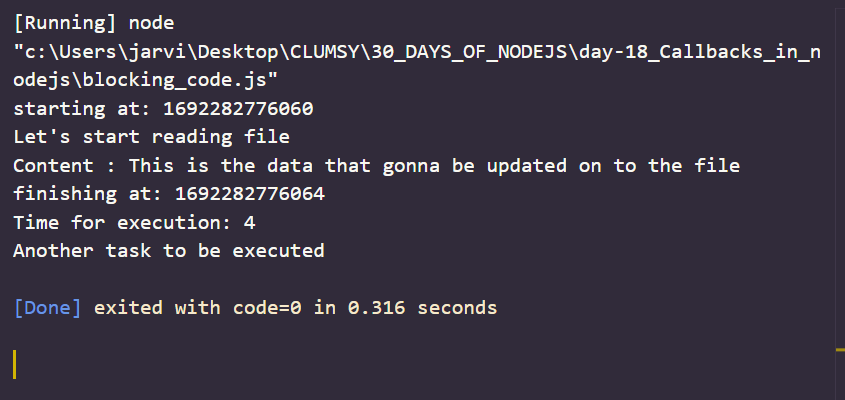
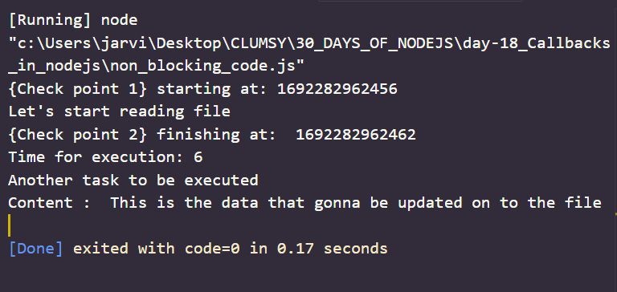

# Day 18
# CONCEPT OF CALLBACKS IN NODEJS

## CALLBACKS

**Node.js is an asynchronous which means node.js doesn't wait for the blocking functions (such as file I/O, calling some RestAPI and waiting for result or writing some data to db, etc) to finish instead node.js uses callbacks and carries on with the execution of other tasks. A callback is simply a asynchronous equivalent for a function which is called after the execution of given task. Concept of callback prevents any blocking in node.js and allow other tasks to be executed in the meantime. It is named callback because at some  point of time it is going to be   `called back`. Node.js makes ample use of callbacks. All APIs in node.js supports the concept of callbacks.**

## Non-Blocking Vs Blocking code

**One of the features which distinguishes Node.js is that it uses non-blocking code. Let's understand by looking at the difference between Blocking and Non-Blocking code. So what're the scenarios where the code can go blocking:**

1. Calling some REST API and waiting for results.
2. Writing some data to a DB.
3. Reading data from a file on FileSystem.
4. Writing data to a file on FileSystem.

### BLOCKING CODE 
**The function whose execution is affected by other functions/tasks or in simple terms which are synchronous in nature comes under blocking code.**

```
//Name of the File is  : blocking-code.js
var fs = require('fs');

//For calculating execution time
var date1 = new Date();
var time_start = date1.getTime();
console.log("starting at: " + time_start);
console.log("Let's start reading file");


//Name of the file to be read
var filename = 'aboutMe.txt'; 
//Reading file synchronously
var content = fs.readFileSync(filename);
console.log('Content : ' + content);


//For calculating execution time
var date2 = new Date();
var time_end = date2.getTime();
console.log("finishing at: " + time_end);
var execution_time = time_end - time_start;
console.log("Time for execution: " + execution_time );


//Consider it some another task in queue
console.log('Another task to be executed');
```

*OUTPUT*


## Non-Blocking Code

**The function whose execution is not affected by other function/tasks or in simple terms which are asynchronous in nature come under non-blocking code.**

```
//Name of the file: non-blocking-code.js
var fs = require('fs');


//For calculating execution time
var date1 = new Date();
var time_start = date1.getTime();
console.log("{Check point 1} starting at: " + time_start);
console.log("Let's start reading file");


//Name of the file to be read
var filename = 'aboutMe.txt'; 
//Reading file asynchronously
fs.readFile('output.txt', (err, data) => {
	if (err) 
		throw err;
		
	console.log("Content :  " + data);
});


//For calculating execution time
var date2 = new Date();
var time_end = date2.getTime();
console.log("{Check point 2} finishing at:  " + time_end);
var execution_time = time_end - time_start;
console.log("Time for execution: " + execution_time );
//Consider it some another task in queue
console.log('Another task to be executed');
```
*OUTPUT*


## Avoiding callback hell 

1. `Modularization` : By making our code as much modular as possible, callback hell can be avaided.
2. `Promise` : We can use the concepts of promises to avoid callback hell.
3. `Async.js` : Async is a very powerful module on npm , which can be used to avoid callback hell.
4. `Chaining promises `: We can avoid callback hell by chaining promises.