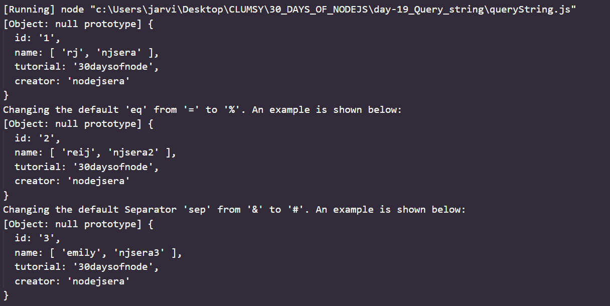
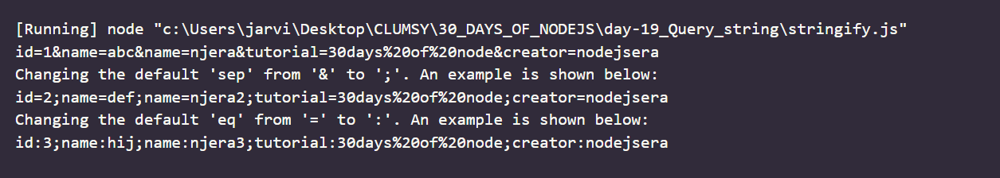

# Day 19
# QUERY STRING 

**Query string module in node.js is used to provide utilities for parsing and formatting URL query string. It also provide methods used for converting JSON to query string and query string to JSON. We can require the query string module in the following way:**
` var qs = require('querystring)`


## Methods in QUERY string 

1. `querystring.parse(str, sep**, eq**, options**) `: This method is used to parse a URL query string to a collection of key and value pairs. i.e. to JSON. 
*Note : ** indicates optional parameters*

```
//Name of the File : qs-parse.js
var qs = require('querystring'); 

var value_json = qs.parse('id=1&name=rj&name=njsera&tutorial=30daysofnode&creator=nodejsera')
console.log(value_json);  

var value_json_2 = qs.parse('id%2&name%reij&name%njsera2&tutorial%30daysofnode&creator%nodejsera','&','%');
console.log("Changing the default 'eq' from '=' to '%'. An example is shown below:");
console.log(value_json_2); 

var value_json_3 = qs.parse('id%3#name%emily#name%njsera3#tutorial%30daysofnode#creator%nodejsera','#','%');
console.log("Changing the default Separator 'sep' from '&' to '#'. An example is shown below:")
console.log(value_json_3);
```




2. `querystring.stringify(obj , sep**, eq**, options**)` : This method is used to produce a URL from a collection of key and value pairs i.e. from JSON.

```
//Name of the File : qs.stringify.js
var qs = require('querystring'); 

var value_json = qs.stringify({ id: 1, name: ['abc', 'njera'], tutorial: '30days of node', creator : 'nodejsera' });
console.log(value_json); 

var value_json_2 = qs.stringify({ id: 2, name: ['def', 'njera2'], tutorial: '30days of node', creator : 'nodejsera' },';');
console.log("Changing the default 'sep' from '&' to ';'. An example is shown below:");
console.log(value_json_2); 

var value_json_3 = qs.stringify( {id: 3, name: ['hij', 'njera3'], tutorial: '30days of node', creator : 'nodejsera' },';',':');
console.log("Changing the default 'eq' from '=' to ':'. An example is shown below:")
console.log(value_json_3);
```

*OUTPUT*
