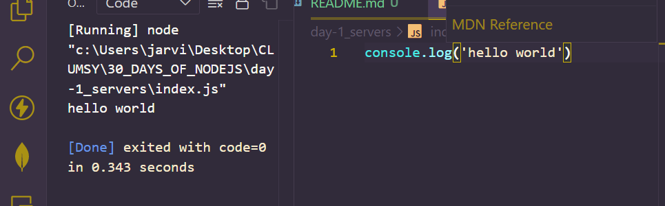
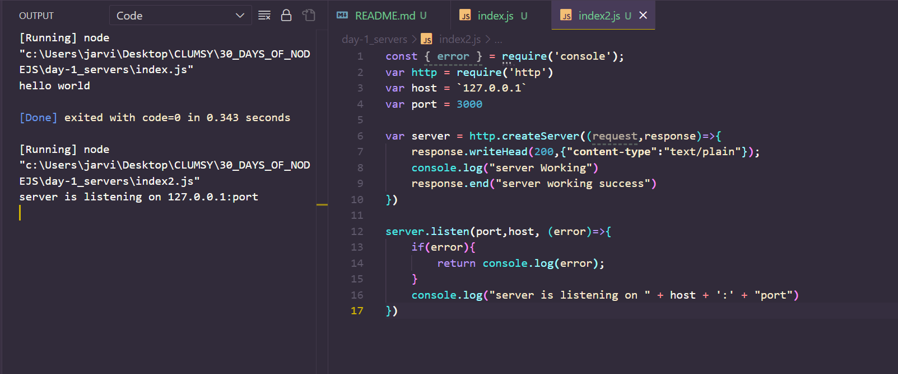
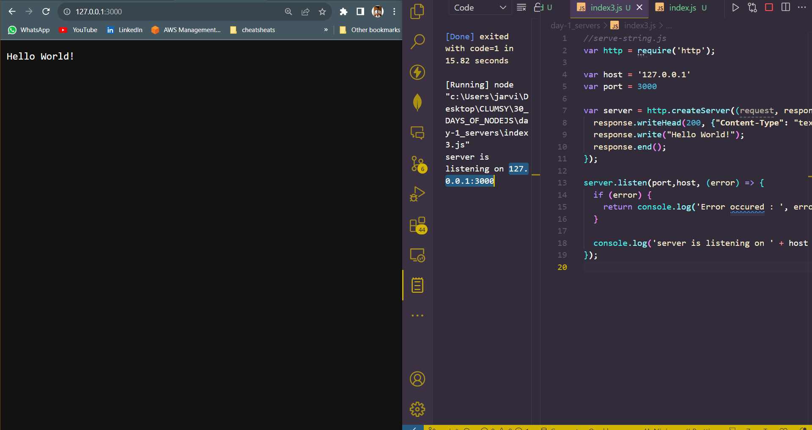
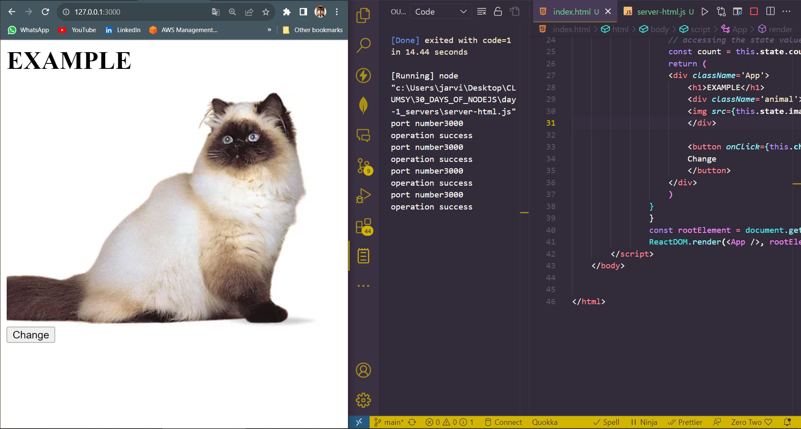
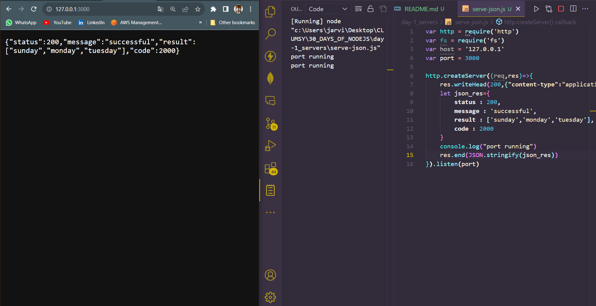
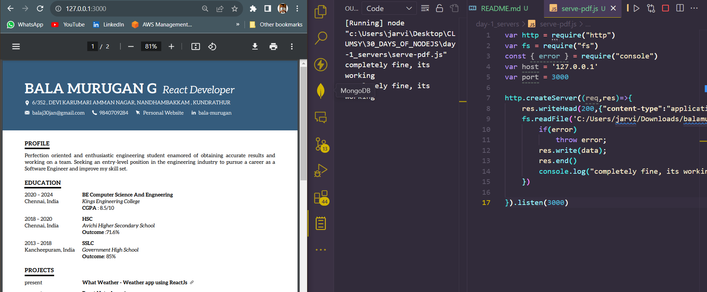

# Day 1 
## ALL ABOUT SERVERS 

**Node.js is a platform which is built on google chrome's javascript v8 engine. It is cross platform and is capable of generating real time web application. It uses event-driven, non-blocking I/O operation model which makes it efficient and light-weight. It's package ecosystem is `npm` is the largest ecosystem of open source libraries in the world.**

### Hello world in nodejs
`console.log('hello-world')`

*Output*ls nng lsk



## CREATION OF SERVER IN NODE JS
- Node provide us with the inbuilt `http` module which we can use to create server. Get the access to the module by using `require`
- Mention the host localhost(127.0.0.1) to serve it locally.
- Mention the port. 
- create a server using `createServer()` method. This method takes a callback function as arguments. This callback is executed each time a request is received.
- The two arguments of `createServer()` method are `request`: which contains all the info related to client's request such a URL, custom header, client info, etc. 
`response`: which is used to return the data back to client.
- `response.writeHead`  is an inbuilt method which is used to send the status code.
- print the value using `console.log`
- `response.end()` is an inbuilt function which is used to tell the server that the request has been fulfilled. Along with that we can also send one response using this. 
- `server.listen()` is an inbuilt function to make the server stay alive on a specific host.

*code*
```
const { error } = require('console');
var http = require('http')
var host = `127.0.0.1`
var port = 3000

var server = http.createServer((request,response)=>{
    response.writeHead(200,{"content-type":"text/plain"});
    console.log("server Working")
    response.end("server working success")
})

server.listen(port,host, (error)=>{
    if(error){
        return console.log(error);
    }
    console.log("server is listening on " + host + ':' + "port")
})
```


## Create Server in node js and server a string

```
//serve-string.js						
var http = require('http');

var host = '127.0.0.1'
var port = 3000

var server = http.createServer((request, response) => {
  response.writeHead(200, {"Content-Type": "text/plain"});
  response.write("Hello World!");
  response.end();
});

server.listen(port,host, (error) => {  
  if (error) {
    return console.log('Error occured : ', error );
  }

  console.log('server is listening on ' + host + ':'+ port);
});	
			
```
*Output*


## CREATION OF SERVER AND SERVE HTML
```
var http = require("http")
var fs = require('fs')


var port = 3000
http.createServer(function (req,res) {
    console.log("port number"+ port)
    res.writeHead(200,{"content-type":"text/html"}) // mentioned as text/html, make sure always
    fs.readFile("index.html",(err,data)=>{
        if(err)
            throw err;
        console.log("operation success")
        res.end(data)
    })
}).listen(3000)
```


## CREATE A SERVER AND SERVER JSON
```
var http = require('http')
var fs = require('fs')
var host = '127.0.0.1'
var port = 3000

http.createServer((req,res)=>{
    res.writeHead(200,{"content-type":"application/json"})
    let json_res={
        status : 200,
        message : 'successful',
        result : ['sunday','monday','tuesday'],
        code : 2000
    }
    console.log("port running")
    res.end(JSON.stringify(json_res))
}).listen(port)
```


## Create a server and server pdf
```
var http = require("http")
var fs = require("fs")
const { error } = require("console")
var host = '127.0.0.1'
var port = 3000

http.createServer((req,res)=>{
    res.writeHead(200,{"content-type":"application/pdf"})
    fs.readFile('C:/Users/jarvi/Downloads/balamurugan_resume.pdf',(error,data)=>{
        if(error)
            throw error;
        res.write(data);
        res.end()
        console.log("completely fine, its working")
    })

}).listen(3000)
```


## Day 1 done. 
