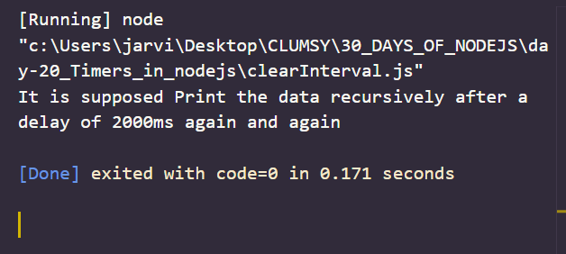

# Day 20
# Timers in node.js

**Timers modules in Node.js exposes a global API which is used to schedule functions to be called later at some given time. Node.js timer is a construct which is used to call a particular function after a given time. Also when the function is called depends upon which timer function is associated with it while creating it and also what word `node.js even loop` is doing. We don't need to explicitly call `timers` function because of their global access.**

# Set timer methods 

1. `setImmediate(callback,args*)` : This method will execute the code the end of current cycle of the event loop. This method will be executed after any I/O operations which are in the current event loop but before timers scheduled for the next cycle of event loop. 

```
function hello () {  
    console.log("This will run Immediately");  
  }  
  console.log("It will Print the data Immediately")
  setImmediate(hello);
```

*OUTPUT*


2. `setInterval(callback,delay,args**)`: If there is a block of code that we want to run multiple times , we can use `setInterval()` to execute that code. This method takes a function as its first argument which will run infinitely with a delay given in milliseconds as the second argument. We can pass more additional arguments also but it is optional and depends upon coders requirements. Also, the delay should be  treated as a approximate delay because it depends on the state and operations that may be hold on to the event loop. 

```
const hello =()=>{
    console.log("This message is printed after 2 seconds ")
}

console.log("this message is printed at first out of the callback function hello")
setInterval(() => {
    hello()
}, (2000));
```

*OUTPUT*


3. `setTimeout(callback,delay,args**)`: This method can be used to execute a function after a designated amount of delay. This method accepts function as its first argument and the delay in milliseconds as second argument. We can pass more additional arguments also but it is optional and depends upon coders requirements.

```										
function hello () {  
    console.log("This will run only once");  
  }  
  console.log("It will Print the data once after the delay of 2000ms")
  setTimeout(hello,2000); 
```
*output*


## CLEAR TIMER METHODS 
1. `clearImmediate(immediate)` : This method is used to clear the object created by `setImmediate()` function upon its execution. 

```
const sayHello=()=>{
    console.log(" hello all")
}
console.log("It is supposed to print the data immediately")
var imm = setImmediate(sayHello)
clearImmediate(imm)
```
*OUTPUT*


2.  `clearInterval(timeout)`: This method is used to clear the object created by `setInterval()` function upon it execution.

```
function hello () {  
    console.log("This will Not Run at all");  
  }  
  console.log("It is supposed Print the data recursively after a delay of 2000ms again and again")
  var s_int = setInterval(hello,2000); 
  clearInterval(s_int);
```
*OUTPUT*


3. `clearTimeout(timeout)`: This method is used to clear the object created `setTimeout` function upon its execution.

```
function hello () {  
    console.log("This will not run at all");  
  }  
  console.log("It is supposed to Print the data once after the delay of 2000ms")
  var tim = setTimeout(hello,2000);  
  clearTimeout(tim);
```
*OUTPUT*

