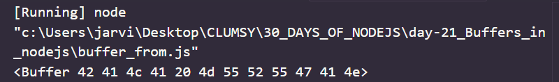

# Day 21
# Introduction to Buffers 
**Buffer refers to space in memory which is used to store data temporarily. A buffer has traditionally been used between devices with speed mis-match so that they can keep on operating at their respective speeds without loss of data. In Node.js Buffers are used when dealing with file streams or tcp streams which are mainly octets of binary data.**

## Buffer methods

- `Buffer.alloc()`:This method is used to create a Buffer object of given length with initializing all the value to fill or 0 .

1. syntax: The syntax of `Buffer.alloc()` method is given below:

`Buffer.alloc(size[,fill[,encoding]])`

*Where ,*
- size : Desired length of new Buffer. It accepts integer type of data.
- fill : The value to prefill the buffer. Default value is 0 .It accepts any of the follwing : integer , string , buffer type of data.

```
var buff=Buffer.alloc(20)
console.log(buff)
```
*OUTPUT*


- `Buffer.allocUnsafe()`: This method is used to create a Buffer object of given length but it will not initialize the values.Due to which contents of the newly created buffer are not known which causes a security threat because it might contain some sensitive or confidential data.

`Buffer.allocUnsafe(size)`

- size : Desired length of new buffer. It accepts `integer` type of data. 

```
var buff = Buffer.allocUnsafe(10)
console.log(buff)
```

*OUTPUT*


- `Buffer.from()`: This method is used to create a Buffer from an string, object, array or buffer. 
`Buffer.from(string[,encoding])`
- string: data is passed here.
- encoding: the encoding of string. Default is `utf-8`

```
var buff= Buffer.from('BALA MURUGAN')
console.log(buff)
```
*OUTPUT*


-`buf.compare() `: This method is used to compare buffers. It returns
- 0 : If both buffers are same
- 1 : If target buffer comes before the source buffer.
- -1 : If source buffer comes before the target buffer.

`buf.compare(target[,targetStart[,targetEnd[,sourceStart[,sourceEnd]]]])`

*Where ,*
- target : target buffer.
- targetStart : Position from where comparion begins on target buffer.
- targetEnd : Position on which comparison ends on target buffer.
- sourceStart : Position from where comparion begins on source buffer.
- sourceEnd : Position on which comparison ends on source buffer.

```
var buffer1 = Buffer.from('Nodejs');
var buffer2 = Buffer.from('MODERN');
var output = buffer1.compare(buffer2);
console.log(output)
if(output < 0) {
   console.log(buffer1 +" comes before " + buffer2);
}else if(output == 0){
   console.log(buffer1 +" is same as " + buffer2);
}else {
   console.log(output +" comes after " + buffer2);
}						
	
```
*OUTPUT*


- Buffer.concat():This method is used to concatenate two or more buffers together.
`Buffer.concat(list)`

```
var buff1 = Buffer.from('Nodejsera for nodejs');
var buff2 = Buffer.from('- 30 days of node');
var buff3 = Buffer.concat([buff1,buff2]);
console.log("buff3 content: " + buff3.toString());	
```
*output*
```
>node buffer.concat.js
buff3 content: Nodejsera for nodejs- 30 days of node
```

- buf.copy(): This method is used to copy specified amount of bytes from source buffer to target buffer.

`buf.copy(target[,targetStart[,sourceStart[,sourceEnd]]])`

```
//Name of the file : buffer.copy.js
var buff = Buffer.from('SELF LEARNING');
var newbuff = Buffer.alloc(20);
buff.copy(newbuff);
console.log("Content of newbuff :  " + newbuff.toString());	
```
*OUTPUT*
```
>node buffer.copy.js
Content of newBuff : SELF LEARNING
```

- `buf.fill() `: This method is used to fill the buffer with a specified value.

- `buf.indexOf() `: This method is used to check whether the buffer contains a specified value. If the value is present it will return the index of first occurrence of the value, otherwise it will return -1 .

- `buf.length` : This method is used to return the length of buffer object.

- `buf.slice()` : This method is used to slice the buffer into a new buffer with specified start and end point.

`buff.slice([start[,end]])`

```
var buf = Buffer.from('SELF LEARNING')
var newbuf = buf.slice(0,5)
console.log(newbuf)
```
*OUTPUT*


- `buf.toJSON() `: used to convert buffer into JSON. 
`buf.toJSON`    
```
var buf = Buffer.from('Nodejsera');
var json = buf.toJSON(buf);
console.log(json);		
```
*output*


- `buf.toString() `: This method is used to convert the buffer into string.
