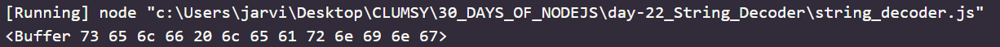

# Day 22
# String Decoder

**String decoder module in node.js is used to provide an API for decoding buffer object into strings. Also , this decoding is performed in a manner that UTF-8 and UTF-16 characters multibyte coding is preserved. We can require the query string module in the following way :**
`var sd = require('string_decoder).StringDecoder`

# METHODS

1. `stringDecoder.write(buffer)`:This method is used to return the specified buffer as decoded string. We pass buffer as the argument in this method . An example is given below :

```
var stringdeco = require('string_decoder').StringDecoder
var sd = new stringdeco('utf-8')

var buff= Buffer('self learning')
console.log(buff)
console.log(sd.write)
```
*OUTPUT*


2. `stringDecoder.end([buffer])` : This method is used to return the remaining of the input stored in internal buffer.