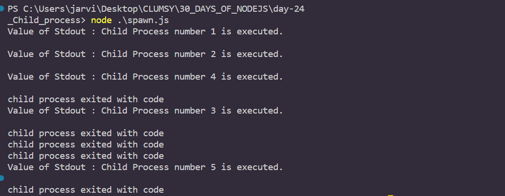
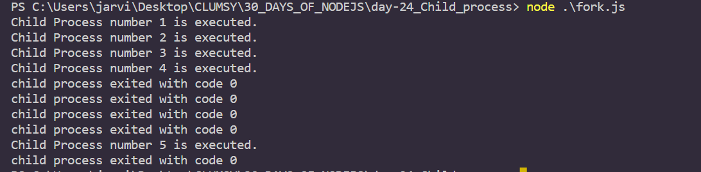

# Day 24
# Child Processes in node.js

**Node.js , being single threaded itself , works superbly fine with single processes in a CPU but a single process in a single CPU is not enough to handle the increasing load. Limitation of a single threaded process is that no matter how advanced or powerful our server may be , it does have a limit to support load. Moreover, Node.js is single threaded but it does not mean that we can't take the advantage of multiple process.**

**Node.js's child process module is the solution with the help of which we can create many sub-processes or child processes of a single process which can be used to handle the load. These child processes can communicate with each other using inter process communication. child_process module is also used to access operating system functionalities by running OS commands inside child processes. We can control the input stream as well as the output stream of the child processes. We can also control the arguments to be passed to underlying OS commands. Also , pipes for stdin , stdout and stderr are established between the parent and the child node.js process by default. We can stream data through these pipes in non-blocking way.**


## Creating a child process 
*There are four different ways to create a child process*
1. spawn()
2. fork()
3. exec()
4. execFile()
*They can be created synchronously and asynchronously as per our need*

1. `child_process.spawn()` : This method spawns the child process asynchronously without blocking the node.js event loop
2. `child_process.fork() `: This method is used to spawn a new node.js process and also invokes a specific method which provides inter-process communication channel established that allow us to send messages between parent process and child process.
3. `child_process.exec()` : This method is used to spawn a shell and then runs the command within that shell. This method also allows for an optional callback function which will be invoked when the execution of the process is completed.
4. `child_process.execFile() `: This method is similar to child_process.exec() except that it spawns the command directly instead of spawning a shell. This method also allows for an optional callback which will be invoked when the execution of the process is completed.

## 1. child_process.spawn() :

*syntax*
`child_process.spawn(command[, args][, options]`

```
												
//Name of the file : master-spawn.js
var cp = require('child_process');
 
for(var i = 1; i<6; i++) {
   var worker = cp.spawn('node', ['slave.js', i]);

   worker.stdout.on('data', function (data) {
      console.log('Value of Stdout : ' + data);
   });

   worker.stderr.on('data', function (data) {
      console.log('stderr: ' + data);
   });

   worker.on('close', function (code) {
       //console.log("Exit code : " + code);
      console.log('child process exited with code ');
   });
}
```
*output*


## 2. child_process.fork() :
*Syntax*
`child_process.fork(modulePath[, args][, options])`

```
												
//Name of the file : master-fork.js
var cp = require('child_process');
 
for(var i=1; i<6; i++) {
   var worker = cp.fork("slave.js", [i]);	

   worker.on('close', function (code) {
      console.log('child process exited with code ' + code);
   });
}
			
```
*output*


## 3. child_process.exec() :

*Syntax*
`child_process.exec(command[, options][, callback])`

```
// Name of the file :  master-exec.js
var cp = require('child_process');

for(var i=1; i<6; i++) {
   var workerProcess = cp.exec('node slave.js ' + i , function(error, stdout, stderr) {
      if (error) {
         console.log(error.stack);
         console.log('Error Code: '+error.code);
         console.log('Error Signal: '+error.signal);
      }

      if(stderr){
         console.log('value of stderr: ' + stderr);
      }

      console.log('Value of stdout: ' + stdout);
      
     
   });
   workerProcess.on('exit', function (code) {
       //console.log("exit code : "+ code);
      console.log('Child process exited ');
   });
}
			
```
*OUTPUT*
```
>node master-exec.js
Child process exited
Value of stdout: Child Process number 1 is executed.

Child process exited
Value of stdout: Child Process number 2 is executed.

Child process exited
Value of stdout: Child Process number 5 is executed.

Child process exited
Value of stdout: Child Process number 3 is executed.

Child process exited
Value of stdout: Child Process number 4 is executed.
```

## 4. child_process.execFile() :
*Syntax*
`child_process.execFile(file[, args][, options][, callback])`

```
var ef = require('child_process').execFile;
var child = ef('node', ['--version'], (err, stdout, stderr) => {
    if (err) {
        console.log('stderr', stderr);
        throw err;
    }
    console.log('Node.js version  : ', stdout);
});
```

## Synchronous process creation

1. `child_process.spawnSync()` : This method spawns the child process synchronously and it will block the node.js event loop.
2. `child_process.execSync() `: This method is same as child_process.exec() except that it will run synchronously and it will block the node.js event loop, pausing the execution of any other code.
3. `child_process.execFileSync() `: This method is same as child_process.execFile() except that it will run synchronously and it will block the node.js event loop, pausing the execution of any other code.