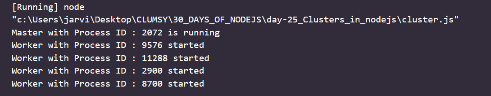

# Day 25
# Clusters in Node.js

**Normally, node.js server runs on a single port and utilize only single core of the OS system which leads to wastage of hardware capabilities. So, in order to take the full use of multi-core system, we launch cluster of node.js processes to handle the load. This process is known as clustering. Clustering in node.js allows us to create different processes which can share the same server port. we can simply access cluster module using the following :**

`var cluster = require('cluster)`

## coding 

```
//Name of the file : cluster.js
var cluster = require('cluster');
var http = require('http');
var numofCPUs = require('os').cpus().length;

if (cluster.isMaster) {
  console.log(`Master with Process ID : ${process.pid} is running`);

  // Fork workers.
  for (var i = 0; i < numofCPUs; i++) {
    cluster.fork();
  }

  cluster.on('exit', (worker, code, signal) => {
    console.log(`worker with Process ID : ${worker.process.pid} died`);
  });
} else {
  // Workers sharing an HTTP server
  http.createServer((req, res) => {
    res.writeHead(200);
    res.end('An example of clusters\n');
  }).listen(3000);
  console.log(`Worker with Process ID : ${process.pid} started`);

}
```

*OUTPUT*


## Methods of cluster Module:

1. Worker : These methods are for the worker processes :
- worker.disconnect() : This method is used to close all servers, wait for the close event on those servers and then disconnect the IPC channel, within the worker.
- worker.exitedAfterDisconnect : This method will return a boolean. The value is set by calling .kill() or .disconnect() , before that the value is undefined . This method is used to distinguish between the voluntary and accidental exit. If the value of .exitedAfterDisconnect is True , then it signifies a voluntary exit.
- worker.id : Each worker is given their unique id. This method is used to print that id on console.
worker.isConnected() :This method returns True if the worker is connected to its master via IPC channel, otherwise it will return false.
- worker.isDead() : This methods returns True if the worker process is terminated or dead , otherwise it will return false.
- worker.kill() : This method is used to kill the worker.
worker.process : This method is used to return the global child process.
- worker.send() : This method is used to send a message to a master or a worker.

2. cluster : Most of these methods are for the master process with couple of exceptions as given below :
- cluster.disconnect() : This method is used to disconnect all the workers which will further allow master process to die properly.
- cluster.fork() : This method is used to spawn a new worker process.
- cluster.isMaster This method returns True if the current process is master , otherwise it will return false.
- cluster.isWorker : This method returns True if the current process is worker , otherwise it will return false.
- cluster.schedulingPolicy :This method is used to set the scheduling policy. The default scheduling policy is round robin for all operating systems except windows.
- cluster.settings : This method will return an object which contains all the settings related to the cluster.
- cluster.setupMaster() : This method is used to change the default settings of master process which can be seen using - cluster.settings method.
- cluster.worker : This method is an reference to the current worker object. It is not available in the master process.
- cluster.workers : This method contains a hash which stores all the active worker objects. This method is not available in the worker process.