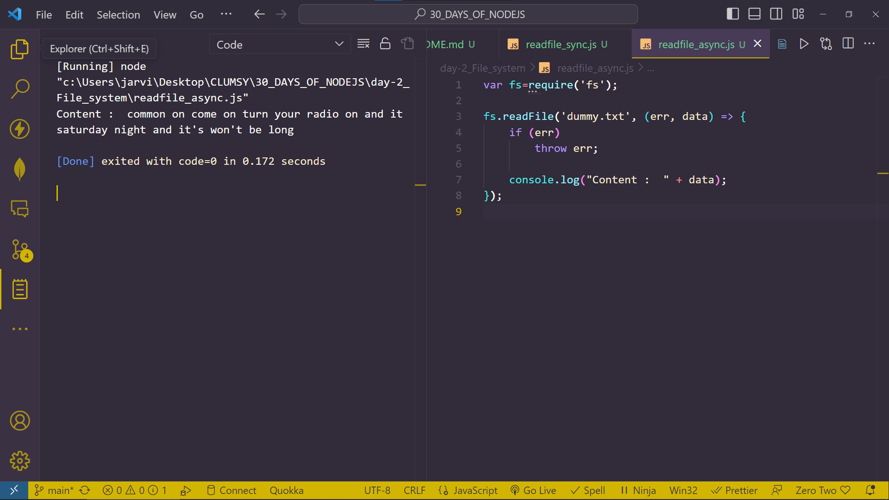
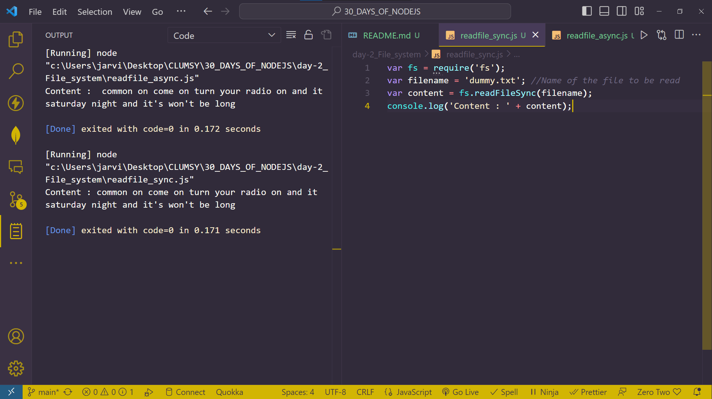
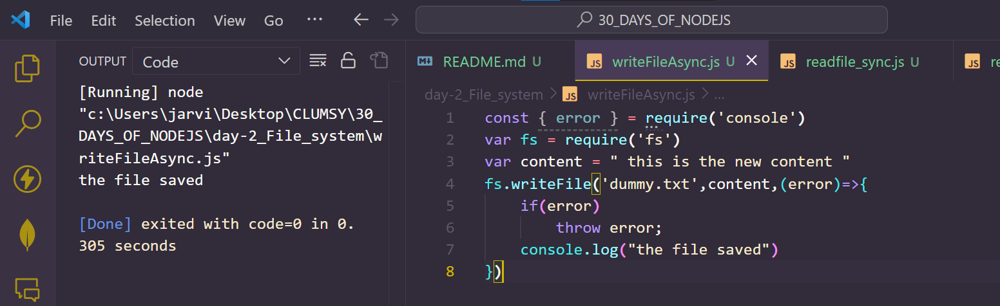
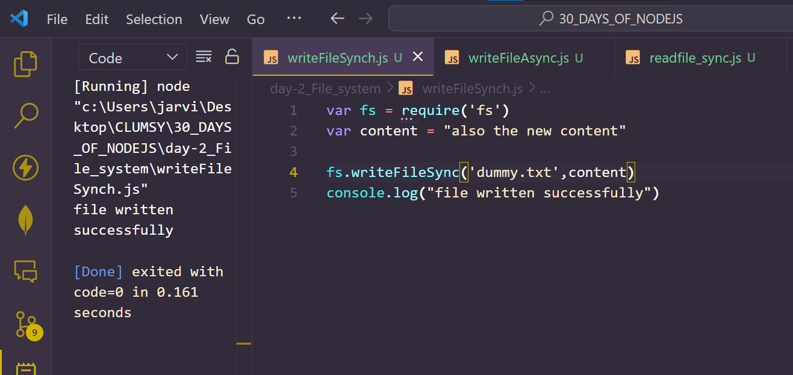
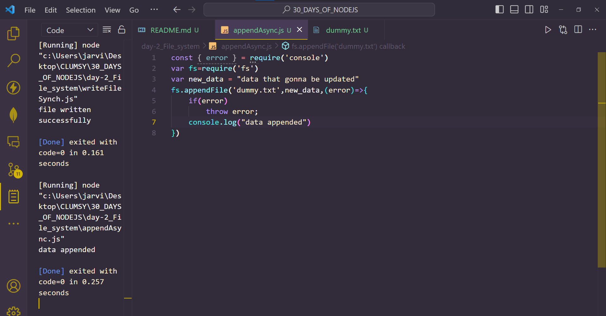
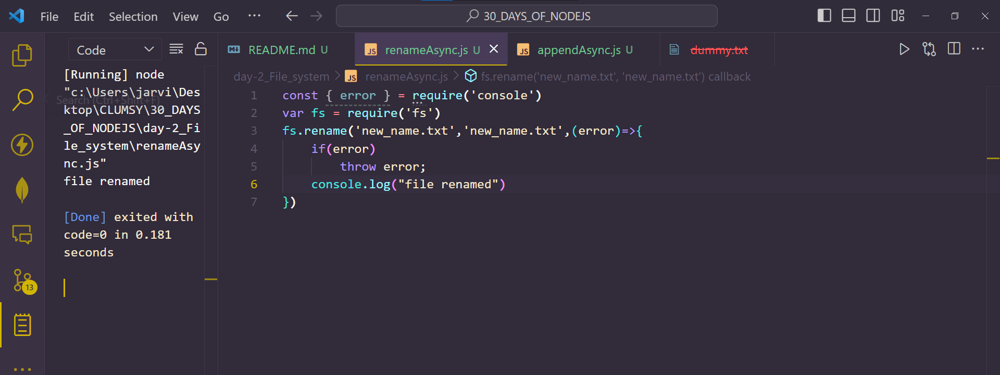
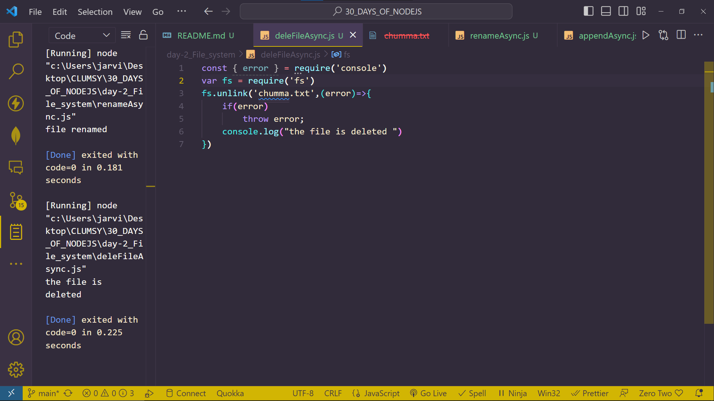

# Day 2
# FILE SYSTEM IN NODE.JS

**Node.js gives the functionality of File I/O by providing wrappers around the standard POSIX functions. In Node.js, File I/O methods can be performed in both synchronous as well asynchronous form depending upon the user requirements. In order to use this functionalities we need to require the fs module as shown below:**

`var fs = require('fs')`

## READ A FILE IN NODEJS
1. Reading  the file Asynchronously

```
var fs=require('fs')
fs.readFile("message.txt",(err,data)=>{
    if(err)
        throw err;
    console.log("content: "+ data)
})
```
*Output*


2. Reading the file Synchronously
```
var fs = require("fs")
var fileName = "context.txt"
var content = fs.readFileSync(fileName)
console.log("Content "" + content )
``` 
*Output*


## WRITING  A FILE IN Nodejs
1. Writing a file Asynchronously 
```
const { error } = require('console')
var fs = require('fs')
var content = " this is the new content "
fs.writeFile('dummy.txt',content,(error)=>{
    if(error)
        throw error;
    console.log("the file saved")
})
```


2. Writing a file Synchronously 
```
var fs = require('fs')
var content = "also the new content"

fs.writeFileSync('dummy.txt',content)
console.log("file written successfully")
```


**Remember: For Async file writing the function is `writeFile`. For Sync file writing the function is `writeFileSync`**

## APPEND A FILE USING NODEJS
1. Appending the file Asynchronously
```
const { error } = require('console')
var fs=require('fs')
var new_data = "data that gonna be updated"
fs.appendFile('dummy.txt',new_data,(error)=>{
    if(error)
        throw error;
    console.log("data appended")
})
```


2. Appending the file synchronously
```
//file append operation in nodejs
var fs = require('fs');
var content = "We are Appending this file synchronously using node.js";
fs.appendFileSync('input.txt', content);
console.log("File Appended Successfully");
```

## RENAME A FILE IN NODEJS
1. Renaming the file Asynchronously 
```
const { error } = require('console')
var fs = require('fs')
fs.rename('new_name.txt','new_name.txt',(error)=>{
    if(error)
        throw error;
    console.log("file renamed")
})
```


2. Renaming the file Synchronously 
```
var fs = require('fs')
fs.renameSync('data.txt','new.txt');
console.log("File ranamed")
```

## DELETE A FILE IN NODEJS
1. Deleting the file Asynchronously
```
const { error } = require('console')
var fs = require('fs')
fs.unlink('chumma.txt',(error)=>{
    if(error)
        throw error;
    console.log("the file is deleted ")
})
```


2. Deleting the file synchronously
```
var fs = require('fs');
var filename = 'data.txt';
fs.unlinkSync(filename);
console.log('File Deleted Successfully');
```
## DAY 2 DONE. 
