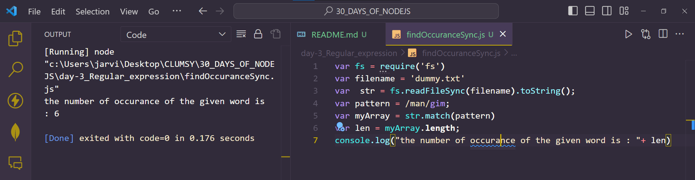
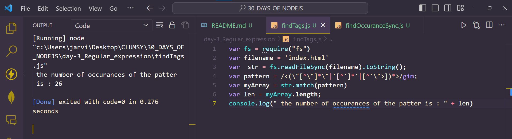
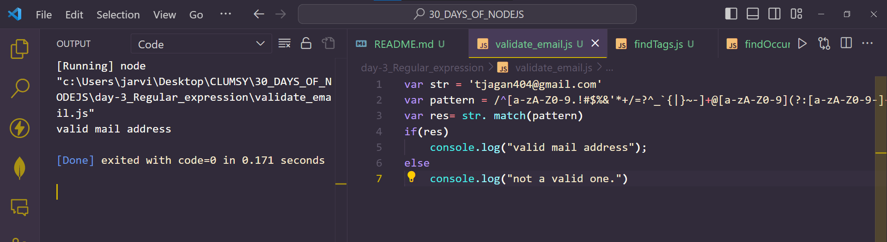
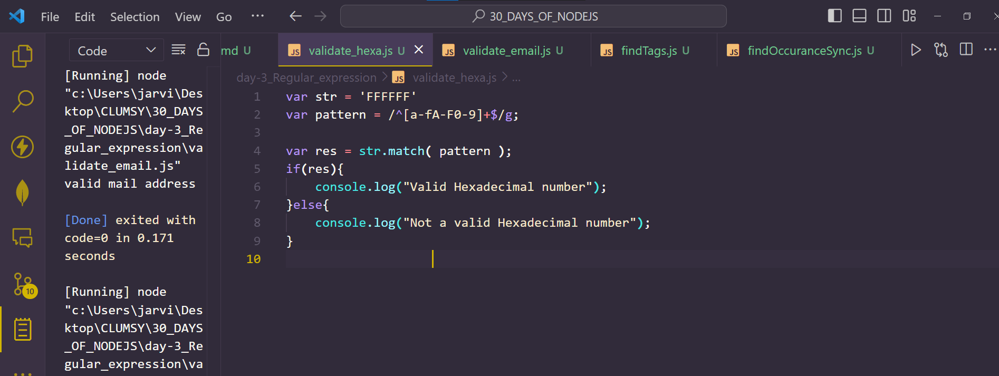

# Day 3
# REGULAR EXPRESSION IN NODEJS

**Regular expression or regex or regexp or sometimes also referred to as rational expression are:**
- A sequence of characters expressing a pattern for further matching in a longer string.
- It is a Text string to describe a pattern which can be used for searching. 
- They are a way to match pattern in the data and extracting the required information out of the data.
- Regex provide a way to find patterns in the data. Finding patterns is on e of the most commonly performed task in computing.
- In everyday life we tend to find a lot of patterns. They cold be email,patterns, they could be phone numbers, keywords of programming language, special characters, html tags and so on.
- And these can be achieved with the power of regular expressions.

## CREATION OF REGULAR EXPRESSION 

1. By regular expression literals: In this, the patterns to be matched is enclosed between the `/`

`var reg= /ab*/`

2. By calling the constructor function: In this, the patterns to be matched comes within the constructor function `RegExp` as shown below:

`var reg=new RegExp('ab*')`

## MOST COMMON USAGES
1. Finding specific text using regular expression: 

**The data set for this example is data.txt . In this, we are reading a file data.txt synchronously and storing the content in str . After that we are providing with the pattern to look for in the file.In this case the pattern is man and further we are using regex modifiers :**
- g : global scope
- i : case insensitive
- m : multiline match 
**and then we are performing the inbuilt function match. And lastly we are printing the Occurrences of the pattern in the content string.The code snippet is given below :**

```
var fs = require('fs')
var filename = 'dummy.txt'
var  str = fs.readFileSync(filename).toString();
var pattern = /man/gim;
var myArray = str.match(pattern)
var len = myArray.length;
console.log("the number of occurance of the given word is : "+ len)
```
*Output*


2. Find the number of tags using regular expression: 
**Find number of tags using regular expression : The data set for this example is index.html . This example is somewhat similar to the above one except for the few changes which are :**
- We are providing an HTML file as dataset for operation.
- Here the pattern is matching tags instead of string.
```
var fs = require("fs")
var filename = 'index.html'
var  str = fs.readFileSync(filename).toString();
var pattern = /<(\"[^\"]*\"|'[^']*'|[^'\">])*>/gim;
var myArray = str.match(pattern)
var len = myArray.length;
console.log(" the number of occurances of the patter is : " + len)
``` 
*Output*


3. Validating emails using regular expression: 
**In this we are giving a email as input in order to find out whether it met all the constraints of being a valid one.The pattern will match the constraints such as @ (1 Occurrence) , domain is provided , sub-domain , etc. After matching , if the email is a valid one it will console "Valid" and "Please enter a valid email" if the email provided is not a valid one.The code snippet is provided below :**
```
var str = 'tjagan404@gmail.com'
var pattern = /^[a-zA-Z0-9.!#$%&'*+/=?^_`{|}~-]+@[a-zA-Z0-9](?:[a-zA-Z0-9-]{0,61}[a-zA-Z0-9])?(?:\.[a-zA-Z0-9](?:[a-zA-Z0-9-]{0,61}[a-zA-Z0-9])?)*$/;
var res= str. match(pattern)
if(res)
    console.log("valid mail address");
else
    console.log("not a valid one.")
```


4. Validating Hexadecimal number using regular expression: 
**This is also a very common example. In this we are checking/validating whether the provided string is a valid hexadecimal or not. Hexadecimal number ranges from :**
- [0-9]
- [A-F]
- [a-f]
**If the string provided is within this range then it's a valid one otherwise not a the code snippet provided below will check that:**

```
var str = 'FFFFFF'
var pattern = /^[a-fA-F0-9]+$/g;

var res = str.match( pattern );
if(res){
	console.log("Valid Hexadecimal number");
}else{
	console.log("Not a valid Hexadecimal number");
}
					
```


5. Validating passwords using regular expression: 
**As we all must have observed that in order to make the password strong we provide the user with some criteria to be met for creating a password such as :**
- Password must contain 1 capital letter [A-Z]
- Password must contain 1 small letter [a-z]
- Password must contain 1 number [0-9]
- Password must contain 1 special character [!,@,#,$,%,^,. . . ] etc
- Length of the password must be within the range [6 to 16]
**So we created a regex to validate whether the provided password met all the constraints or not. If the provided password met all the constraints it will console "Valid Password" and snippet will console "invalid password" if any of the above mentioned condition is not met.**

```
var str = 'Aabcde'
var pattern = /^(?=.*[0-9])(?=.*[!@#$%^&*])[a-zA-Z0-9!@#$%^&*]{6,16}$/;;

var res = str.match( pattern );
if(res){
	console.log("Valid password");
}else{
	console.log("Not a valid password");
}
					
```

