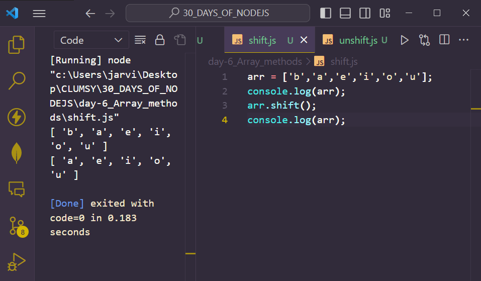

# Day 6
# ARRAY METHODS IN NODEJS

## Creation of array 
1. Usual way 
` var names = ['jagan','vicky','ram','imman','mohan'] ` 
`console.log(names)`

2. Using Object 
`var arr = new Array(3);`
`arr=[2,3,4]`

3. Declare and initialize in a single statement.
`var arr1 = new Array(2,3,4);`
`console.log("arr : "+ arr)`
`console.log("arr" + arr1) ;`

*Output*
```					
>node create-array.js
[ 'rj', 'ricky', 'alex' ]
3
arr : 1,5,7
arr 1 : 2,5,7
```

## push() Method in arrays 
**`push` method in arrays is used to insert an element in the  end of the array**

```
array = [23,34,4,4,5,5]
console.log(array)
array.push(34)
console.log(array)

```
*Output*


## pop() Method in arrays
**`pop` method in arrays is used to remove the last element from the array:**

```
array = [1,2,3,4,5]
console.log(array)
array.pop()
console.log(array)
```
*Output*


## unshift() Method in  arrays 
**`unshift` method in arrays is used to insert an element in the beginning of the array.**

```
arr = [ 5 , 5 , 8 , 7 , 6 ];
console.log(arr);
arr.unshift(1);
console.log(arr);							
					
```
*Output*


## shift() Method in arrays
**`shift()` method in arrays is used to insert an element in the beginning of the array.**

```
arr = ['b','a','e','i','o','u'];
console.log(arr);
arr.shift();
console.log(arr);				
```
*Output*


## reverse() Method in arrays 
**`reverse` method is used to reverse the order of the array such that the first element become the last and the last element become es the first.**

```
arr = [1,2,3,4,5,6,7,8,9]
console.log(arr)
arr.reverse()
console.log(arr)
```
*Output*


## sort() Method in arrays 
**`sort` method in used to sort the elements of the array in term of their occurrences.**

```
var array = ['c','d','a','b'];
console.log(array)
array.sort()
console.log(array)
```
*OUTPUT*


## splice() Method in arrays 
**`splice` method can be used in two ways i.e to either add the element into the required index or to remove from the same.**

1. Add using splice : 
```
array = [2,3,4,5,6]
console.log(array)
array.splice(2,2,'a','b')
// the first argument  is the index number 
// second argument is the number of elements that we are going to add
// following arguments are the respective values. 
console.log(array)
```
*OUTPUT*


2. Remove using splice: 
```
array = [2,3,4,5,6]
console.log(array)
array.splice(2,2)
// the first argument  is the index number 
// second argument is the number of elements that we are going to remove
console.log(array)
```
*OUTPUT*


## concat() Method in arrays
**`concat` method is used to join two arrays and returns a new array consisting the elements of both the arrays one after other.**

```

// METHOD 1
array = [2,3,4,5]
array2 = ['a','b','c']

console.log(array)
console.log(array2)
console.log(array.concat(array2))

// METHOD 2 
array = [2,3,4,5]
array2 = ['a','b','c']

console.log(array)
console.log(array2)
var new_array = array.concat(array2)
console.log(new_array)
```
*OUTPUT*


## indexOf() Method in array 
**To find the first existence index of the passed element**
```
arr = [ 5 , 2 , 8 , 5 , 6 ];
console.log(arr);
var pos = arr.indexOf(8);
console.log("index of 8 is : " + pos);
var pos1 = arr.indexOf(5);
console.log("index of 5 is : " + pos1);	
```

*OUTPUT*
```						
>node indexOf.js
[ 5, 2, 8, 5, 6 ]
index of 8 is : 2
index of 5 is : 0
							
```

## lastIndexOf() Method in arrays
**lastIndexOf method is used to return the last index of the element passed within the array or otherwise it will return -1 if the value is not found. Snippet is given below :**

```
arr = [ 5 , 2 , 8 , 5 , 6 ];
console.log(arr);
var pos = arr.lastIndexOf(5);
console.log("index of 5 is : " + pos);					
```

*OUTPUT*
```
>node lastIndexOf.js
[ 5, 2, 8, 5, 6 ]
index of 5 is : 3
```

## join() method in arrays
**join method is used to join the elements into a string and returns the string. The elements will be separated by a specific separator while joining which will be passed while calling the method. The default separator is , (comma) . Snippet is given below :**

```
arr = [ 5 , 2 , 8 , 5 , 6 ];
arr1 = ['a','b','c','d'];
console.log(arr);
console.log(arr1);
var str = arr.join();
var str1 = arr1.join(":");
console.log(str);
console.log(str1);			
```

*OUTPUT*
```
>node join.js
[ 5, 2, 8, 5, 6 ]
[ 'a', 'b', 'c', 'd' ]
5,2,8,5,6
a:b:c:d
```

## slice() Method in arrays
 **`slice` method is used to extract a section of an array and returns a new array. Slice method take two arguments i.e start and end. If both elements are omitted then it will slice the whole array. Syntax: `slice(start,end)`**

1. `start` : This is an integer which specifies where to start. The default value is index 0 . If omitted like this :: `slice(,end)` it will use the default value as start. We can also start from the end by using negative values . This is optional.

2. `end` : This is an integer value which specifies where to end (last index excluded). If omitted like this :: `slice(start,)` it will slice upto the last element. We can use negative values to select from the end. This is optional.

```
arr = [ 5 , 2 , 8 , 5 , 6 ];
arr1 = ['a','b','c','d'];
console.log(arr);
console.log(arr1);
var str = arr.slice(2,4);
var str1 = arr1.slice(-2,-1);
console.log(str);
console.log(str1);	
```
*OUTPUT*


## every() Method in arrays
**`every` method is used to check whether a condition in fulfilled by all the elements or not. every method returns `true` if the condition is satisfied by all the elements of the array otherwise every method will return `false` . Snippet is given below :**

```
arr = [2,4,6,8,10];
arr1 = [2,3,4,6,8];
function even(value){
    if( (value % 2) == 0){
        return true;
    }else{
        return false;
    }
}

var out = arr.every(even);
var out1 = arr1.every(even);
console.log("Output of array 1 : " + out);
console.log("Output of array 2 :" + out1);		
```
*OUTPUT*


## filter() method in array
**`filter` method is used to create a new array , filled with all the elements that passes a test condition usually passed as a function , from the current array . Snippet is given below :**

```
arr = [2,4,6,8,10];
arr1 = [2,3,4,6,8];
function even(value){
    if( (value % 2) == 0){
        return true;
    }else{
        return false;
    }
}

var out = arr.filter(even);
var out1 = arr1.filter(even);
console.log("Output of array 1 : " + out);
console.log("Output of array 2 :" + out1);	
```
*OUTPUT*


## find() method in arrays
**`find` method returns the first value in the array which passes a test provided as a function. If no element matches the condition , it will return `undefined` . Snippet is given below :**

```
								
arr = [2,4,6,8,10];
arr1 = [2,3,4,7,8];
function odd(value){
    if( (value % 2) == 1){
        return true;
    }else{
        return false;
    }
}

var out = arr.filter(odd);
var out1 = arr1.filter(odd);
console.log("Output of array 1 : " + out);
console.log("Output of array 2 :" + out1);	
```
*OUTPUT*
```
								
>node find.js
Output of array 1 :
Output of array 2 :3,7
								
```

## forEach() method in array
**`forEach` method in arrays is a loop which is used to call a function for each element in the array.**

```
var array = [2,4,5,6,7]
array.forEach((a)=>{
    console.log(a)
})
```
*OUTPUT*


## reduce() method in arrays
**`reduce` method is used to reduce the array to sa singe value. This method executes the provided function for each value of the array and stores the result in accumulator**

```
array = [3,4,54,6,7,78]
console.log(array)
var total = 0;
function add(value,total){
    total = total+value;
    return total
}
var output = array.reduce(add)
console.log("the addition of values inside the array is "+ output)
```
*OUTPUT*
