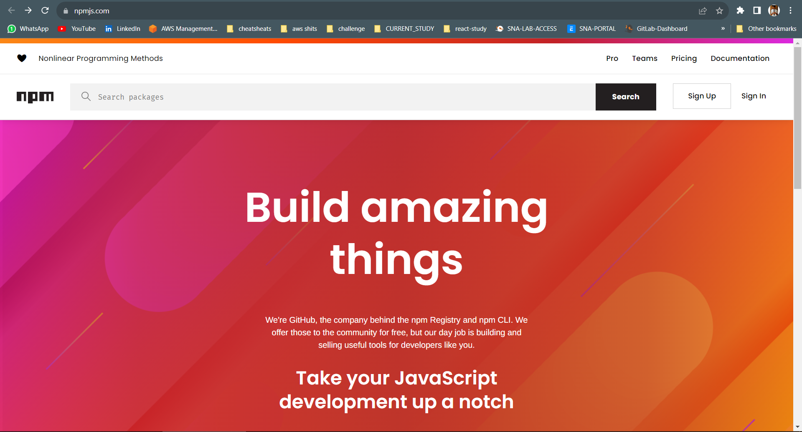
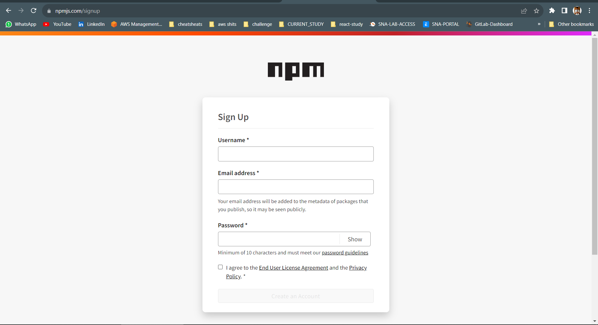
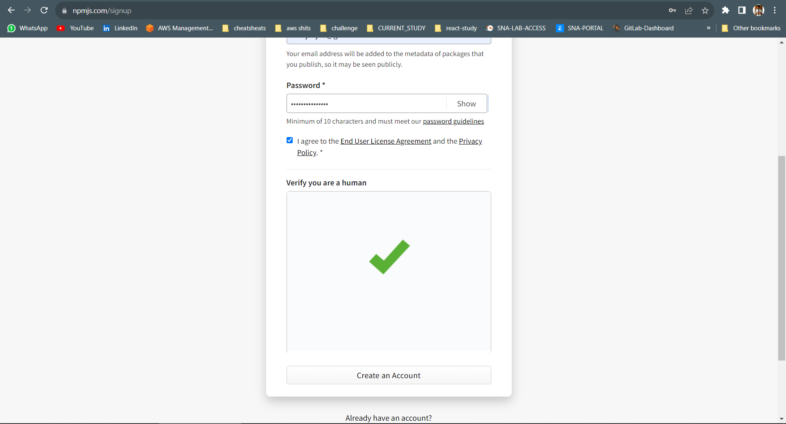

# Day 8
# PUBLISHING PACKAGES ON NPM

## Create your npm account

**If you want to publish a package on nodejs package manager (npm) , then you need to create a account on npm for that. You can create an [npm account here](https://www.npmjs.com/) . Note : If you already have an account , you can skip this step.**

1. Click on sign up : 



2. Enter Your Information:



3. Click on Create Account: 



## Create a package publish ready
**We need to export the methods in order to make them accessible for other applications.This can be done in the following way :**

```
var function_name_1 = function (parameters){
						
					Function code starts
					...				...
					...				...
					Functionality
					...  			...
					...				...
					Function ends here 
					}
var function_name_2 = function (parameters){

						
					Function code starts
					...				...
					...				...
					Functionality
					...  			...
					...				...
					Function ends here 				
					}
module.exports = {
	function_1 : function_name_1,
	function_2 : function_name_2
	}; 
```

***TEST**: WE can test whether this working or not locally by importing it in a local application as shown below:*

```
var fun = require('/filename');
var param = ["a" , "demo" , "array"];
var output =  fun(param);
console.log(output);
```

## Package.json

**This is the most important file while publishing your file.If our package is not having the package.json file then we won't be able to publish your package. We already learned in previous chapter how we can create package.json file. Package.json will hold all the information related to your package.**

## Publishing on npm
*In order to publish a package you need to follow the following steps:*

1. Login: login to your npm account from your command line interface using you account credentials and the command `npm login`. 
```
>npm login
Username: nodejsera
Password:
Email: (this IS public) youemail@nodejsera.com
Logged in as nodejsera on https://registry.npmjs.org/
```
*Successfully logged in*

2. Publish : Run the command `npm publish` in your root folder of package. It will read the data from package.json file. If there is any name conflicts in your package then it will throw an error with respective error message, otherwise your package is published. You can check it on npm 

`>npm publish`

## Updating an already published package
**If we make any changes to our package , then we have to update it on npm also. We can do that by using the command `npm version <update.type >` where update_type is one of the semantic versioning release types, minor,major ,or patch .
It will update the version number in `package.json` file. After updating the version number , we can again publish a package using `npm publish` as shown above.**