# Day 9
# CRYPTO MODULE IN NODE.JS

## INTRODUCTION
**`crypto` module in node.js is used to provide cryptographic functionalities. It includes a set of wrappers for OpenSSL's hash, HMAC ,verify , cipher , decipher, and sign functions. In part-1, we'll learn all about hash and hmac functions.**

## What is hashing ? 
**Hashing is a process of generating a fixed length value from a string using mathematical functions. It is used for providing security.**

- Unique :In hashing , for every unique input we will get unique output. we will get the same output for same input no matter how many times you input the same data But if we just slightly change the input it will change the output to a large extent.

- Fixed length : Hashing algorithm always generate the has with the same length. The length of input does not affect the length of output.

- Irreversible : Generated hashes are irreversible in nature. We can not change the hash to the input text again.

## Different Hashing Algorithm

1. md5 hashing algorithm : MD5 stands for message digest 5 is a widely used hash function which  produces 128-bit hashes.

```
// Loading the crypto module in node.js
var crypto = require('crypto')

// creating hash object
var hash = crypto.createHash('md5')

// passing data to be hashed 
data = hash.update("BALA MURUGAN",'utf-8')

// Creating the hash in the required format
gen_hash = data.digest('hex')

console.log(gen_hash)
```
*Output*
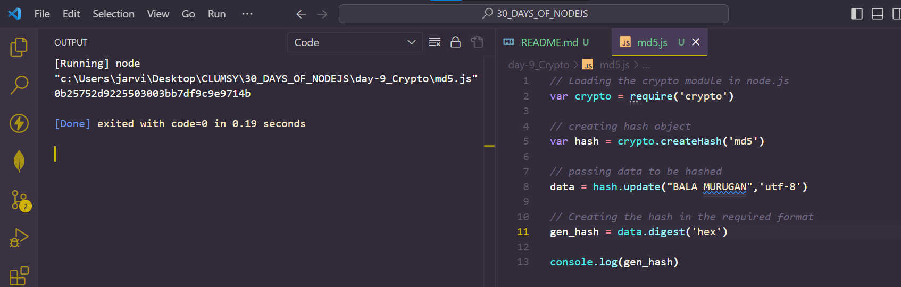

2. Whirlpool hashing algorithm: This hashing algorithm takes input of any length than 2^256 bits and outputs a 512-bit hash.

```
var crypto = require('crypto')
   

var hash = crypto.createHash('whirlpool')

data = hash.update("BALA MURUGAN",'utf-8')

gen_hash = data.digest('hex')

console.log('hash' + gen_hash)
```
*OUTPUT*
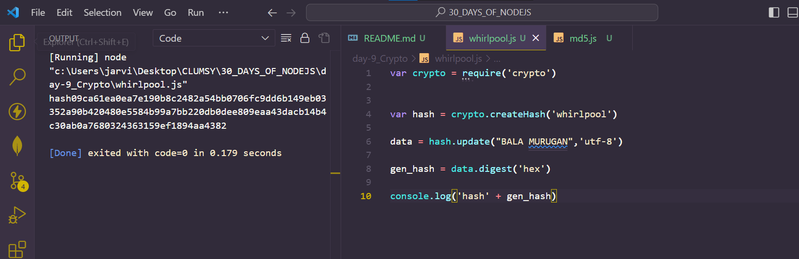

3. SHA1 Hashing algorithm: Secure Hash Algorithm 1 is a cryptographic hash function which generates a hash value which is typically rendered as a hexadecimal number of exactly 40 digits long. It produces a 160-bit hash value which is known as message digest.

```
 //Loading the crypto module in node.js
 var crypto = require('crypto');
 //creating hash object 
 var hash = crypto.createHash('sha1');
 //passing the data to be hashed
 data = hash.update('BALA MURUGAN', 'utf-8');
 //Creating the hash in the required format
 gen_hash= data.digest('hex');
 //Printing the output on the console
 console.log("hash : " + gen_hash);
```
*Output*
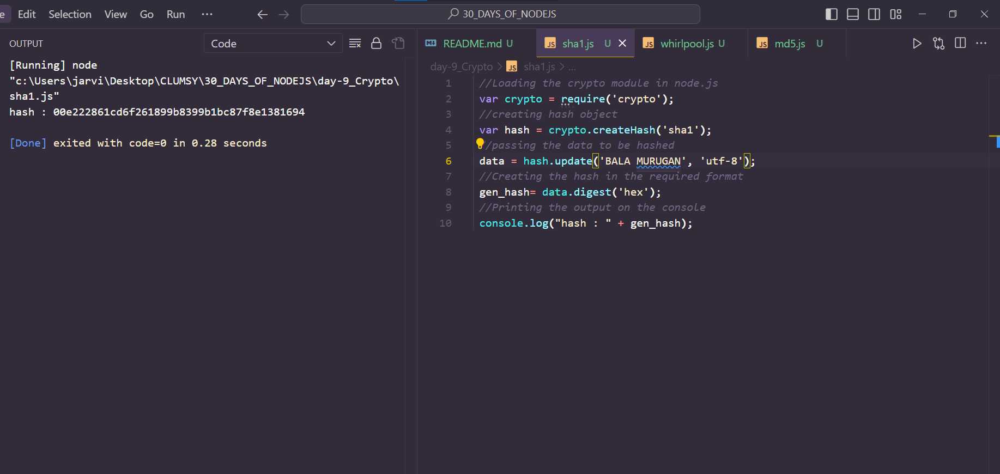

4. SHA224 Hashing algorithm: Secure Hash Algorithm 224 comes under SHA2 and it is a cryptographic hash function which is used to generate hash values.It produces a 224-bit hash value which is known as message digest. Code snippet is given below :

```
 //Loading the crypto module in node.js
 var crypto = require('crypto');
 //creating hash object 
 var hash = crypto.createHash('sha224');
 //passing the data to be hashed
 data = hash.update('BALA THE DEVELOPER OPS', 'utf-8');
 //Creating the hash in the required format
 gen_hash= data.digest('hex');
 //Printing the output on the console
 console.log("hash : " + gen_hash);
```
*OUTPUT*
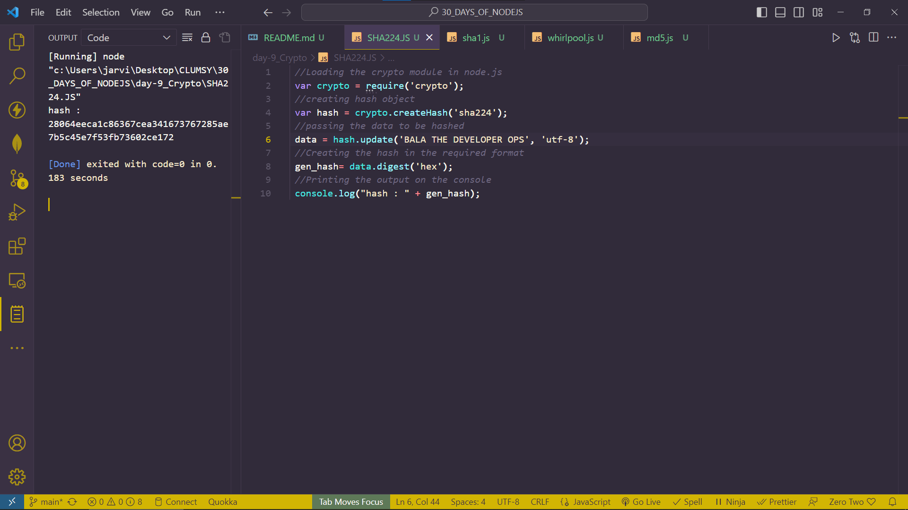

5. SHA226 Hashing algorithm:Secure Hash Algorithm 256 comes under SHA2 and it is a cryptographic hash function which is used to generate hash values.It produces a 256-bit hash value which is known as message digest. Code snippet is given below :

```
//Loading the crypto module in node.js
var crypto = require('crypto');
//creating hash object 
var hash = crypto.createHash('sha256');
//passing the data to be hashed
data = hash.update('bala murugan', 'utf-8');
//Creating the hash in the required format
gen_hash= data.digest('hex');
//Printing the output on the console
console.log("hash : " + gen_hash);
```
*OUTPUT*
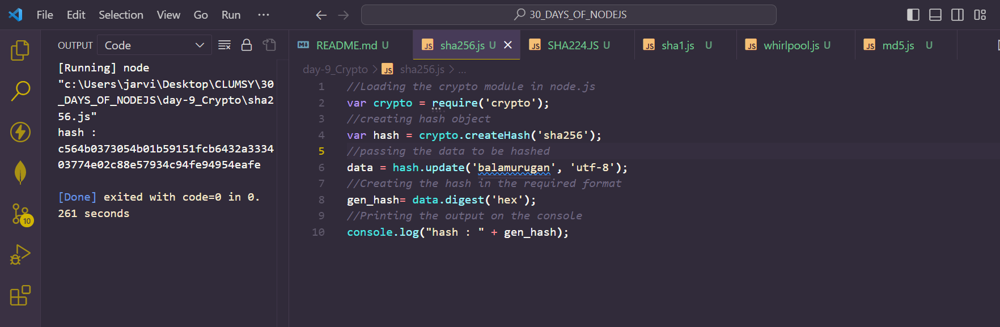

5. SHA384 : Secure Hash Algorithm 384 comes under SHA2 and it is a cryptographic hash function which is used to generate hash values.It produces a 384-bit hash value which is known as message digest. Code snippet is given below :

```
var crypto = require('crypto')
var hash = crypto.createHash('sha384')

data = hash.update("bala murugan",'utf-8')

gen_hash = data.digest('hex')
console.log('hash '+ gen_hash)
```
*OUTPUT*
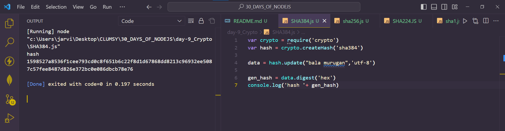

6. SHA512 Hashing algorithm : Secure Hash Algorithm 512 comes under SHA2 and it is a cryptographic hash function which is used to generate hash values.It produces a 512-bit hash value which is known as message digest. Code snippet is given below :

```
//Loading the crypto module in node.js
var crypto = require('crypto');
//creating hash object 
var hash = crypto.createHash('sha512');
//passing the data to be hashed
data = hash.update('BALA MURUGAN', 'utf-8');
//Creating the hash in the required format
gen_hash= data.digest('hex');
//Printing the output on the console
console.log("hash : " + gen_hash);
```
*output*
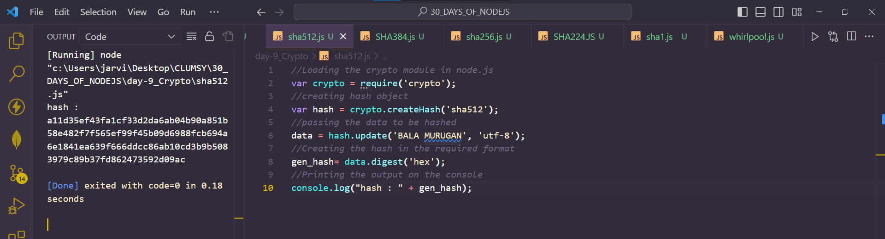

## PERFORM HASHING ON A FILE
**HASHING A FILE: We are hashing  the contents of a file using node.js `streams`, node.js `filesystem` and `SHA256` CRYPTOGRAPHIC hashing algorithm.**

```
//Loading the required modules in node.js
var crypto = require('crypto');
var fs = require('fs');

//Algorithm to be used for HASH
var algorithm = 'sha256';
//creating hash object
var hash = crypto.createHash(algorithm);

// reading the content of the file
var filename = "data.txt";
var file_data = fs.ReadStream(filename);

//passing the data to be hashed
file_data.on('data', function(data) {
  hash.update(data)
})

//Creating the hash in the required format and writing it in file
file_data.on('end', function() {
  var gen_hash = hash.digest('hex')
  console.log('Hash generated using ' + algorithm + ' \nHashed output is :  ' + gen_hash + ' \nFile name is :  ' + filename);
  fs.writeFileSync(filename, gen_hash);
})
	
```

*OUTPUT*
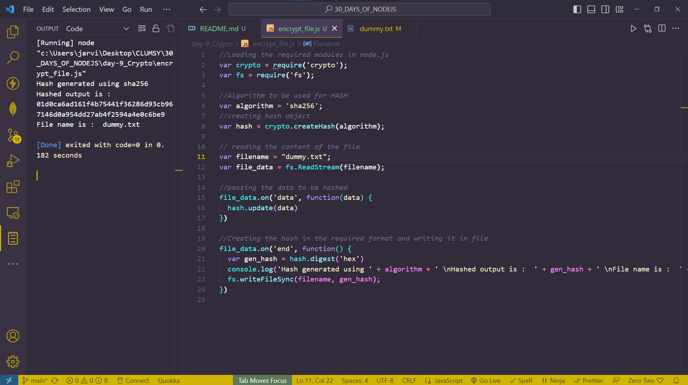

## Problems with hashing 
**One of the biggest problems with hashing includes the `rainbow table` which is a precomputed table for reversing cryptographic hash function.**


## What is hmac ? 
**HMAC ( keyed- hash message authentication code ) is a kind of MAC ( Message authentication code ) which involves performing the hash functions using a secret cryptographic key.**

- Unique: In hashing , for every unique input we will get unique output. we will get the same output for same input no matter how many times you input the same data But if we just slightly change the input it will change the output to a large extent.

- Fixed length : Hashing algorithm always generate the hash with same length. The length of input does not affect the length of output.

- Irreversible : Generated hashes are irreversible in nature. We can no change the hash to the input text again. 

## EXAMPLE OF DIFFERENT HMAC ALGORITHMS 

1. SHA256 HMAC : It is same as hasing the input with SHA256 hashing algorithm as explained above, the only difference is it involves hashing with the help of a secret key as shown in example below :

```
//Loading the crypto module in node.js
var crypto = require('crypto');
//creating hmac object 
var hmac = crypto.createHmac('sha256', 'yoursecretkeyhere');
//passing the data to be hashed
data = hmac.update('BALA MURUGAN');
//Creating the hmac in the required format
gen_hmac= data.digest('hex');
//Printing the output on the console
console.log("hmac : " + gen_hmac);
											
```
*OUTPUT*
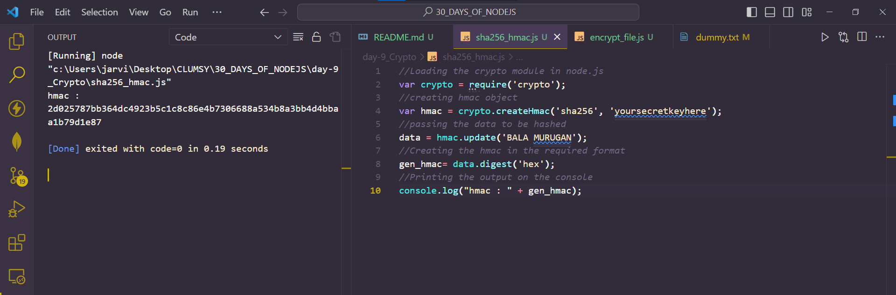

2. SHA512 HMAC : It is same as hasing the input with SHA512 hashing algorithm as explained above, the only difference is it involves hashing with the help of a secret key as shown in example below :

```
//Loading the crypto module in node.js
var crypto = require('crypto');
//creating hmac object 
var hmac = crypto.createHmac('sha512', 'yoursecretkeyhere');
//passing the data to be hashed
data = hmac.update('BALA MURUGAN');
//Creating the hmac in the required format
gen_hmac= data.digest('hex');
//Printing the output on the console
console.log("hmac : " + gen_hmac);
```
*OUTPUT*
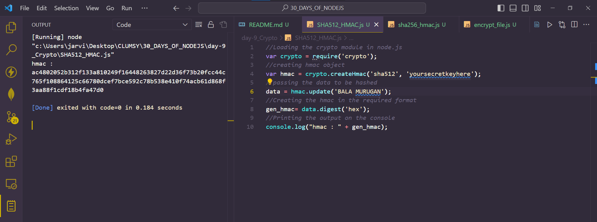

3. MD5 HMAC : It is same as hasing the input with md5 hashing algorithm as explained above, the only difference is it involves hashing with the help of a secret key as shown in example below :

```
//Loading the crypto module in node.js
var crypto = require('crypto');
//creating hmac object 
var hmac = crypto.createHmac('md5', 'yoursecretkeyhere');
//passing the data to be hashed
data = hmac.update('BALA MURUGAN');
//Creating the hmac in the required format
gen_hmac= data.digest('hex');
//Printing the output on the console
console.log("hmac : " + gen_hmac);
```
*OUTPUT*
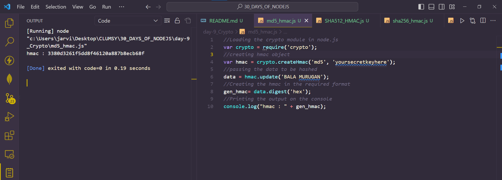

4. Whirlpool HMAC: It is same as hashing the input with whirlpool hashing algorithm as explained above, the only difference is it involves hashing with the help of a secret key as shown in example below:

```
//Loading the crypto module in node.js
var crypto = require('crypto');
//creating hmac object 
var hmac = crypto.createHmac('whirlpool', 'yoursecretkeyhere');
//passing the data to be hashed
data = hmac.update('BALA MURUGAN');
//Creating the hmac in the required format
gen_hmac= data.digest('hex');
//Printing the output on the console
console.log("hmac : " + gen_hmac);
```
*OUTPUT*
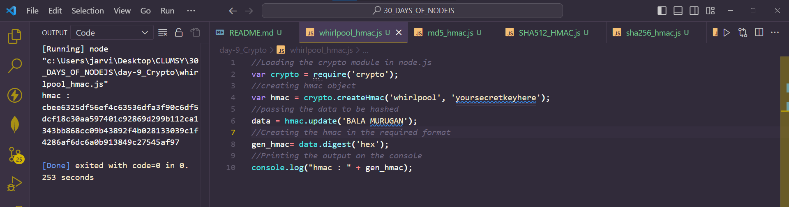


## HMAC ON A FILE 
**HASHING A FILE USING HMAC : We are hashing the contents of a file using node.js `streams`, node.js `filesystem` and `MD5` cryptographic hashing algorithm.**

```
// Including the required modules
var crypto = require('crypto');
var fs = require('fs');

//Algorithm to be used for HMAC
var algorithm = 'md5';
//Secret to be used with HMAC
var secret ='Rj2895647';
//creating hmac object
var hmac = crypto.createHmac(algorithm, secret);

// reading the content of the file
var filename = "dummy.txt";
var file_data = fs.ReadStream(filename);

//passing the data to be hashed
file_data.on('data', function(data) {
  hmac.update(data)
})

//Creating the hmac in the required format and writing it in file
file_data.on('end', function() {
  var gen_hmac = hmac.digest('hex')
  console.log('Hmac generated using ' + algorithm + ' \nHashed output is :  ' + gen_hmac + ' \nFile name is :  ' + filename);
  fs.writeFileSync(filename, gen_hmac);
}) 

```
*OUTPUT*
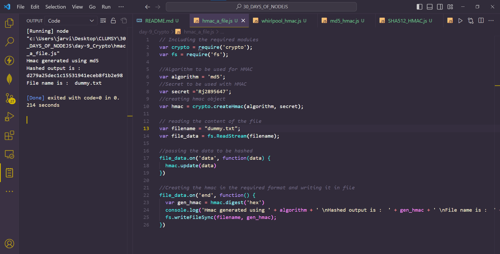